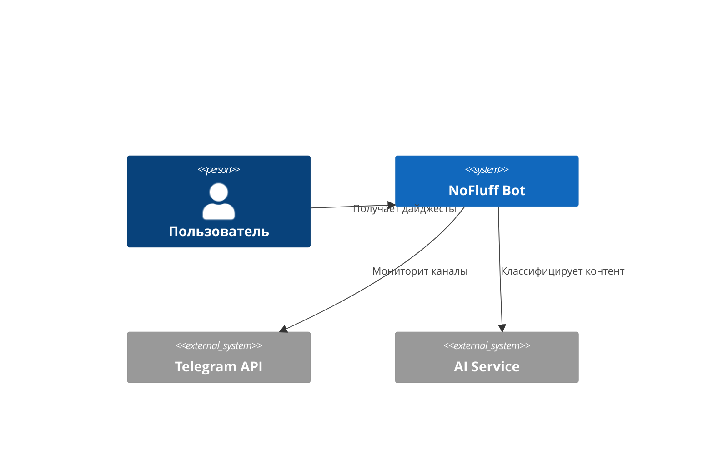
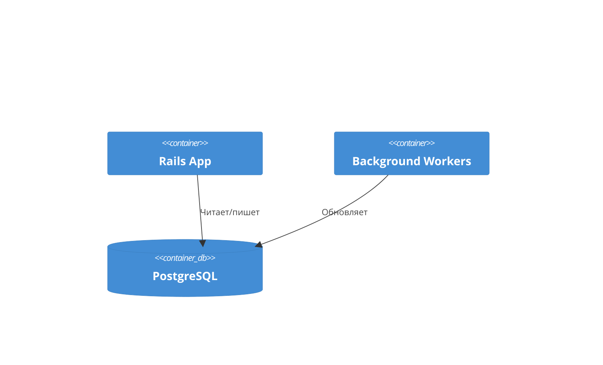
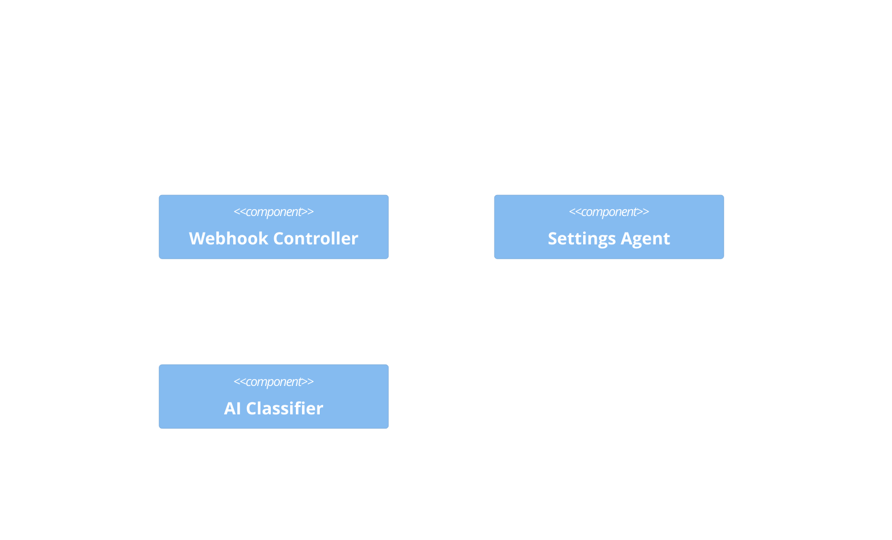
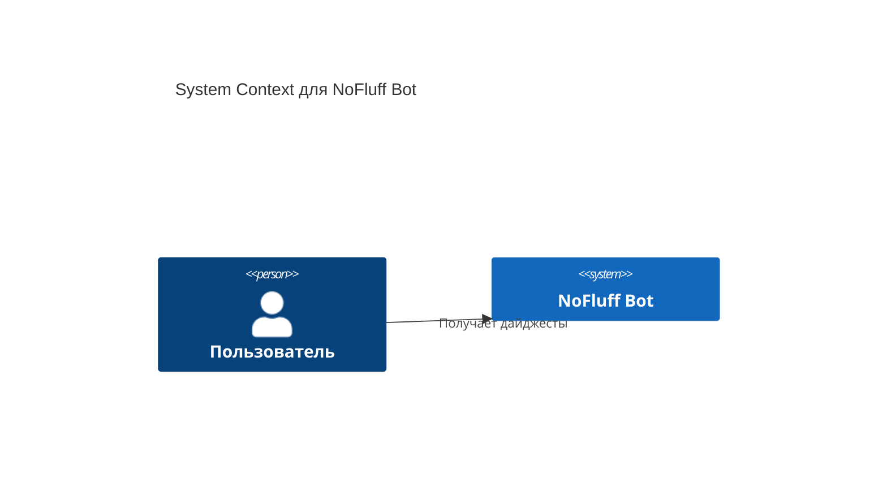
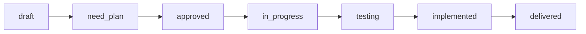
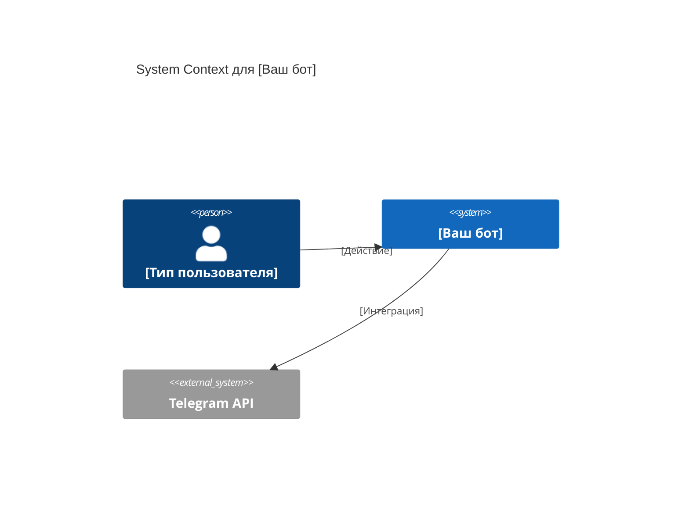
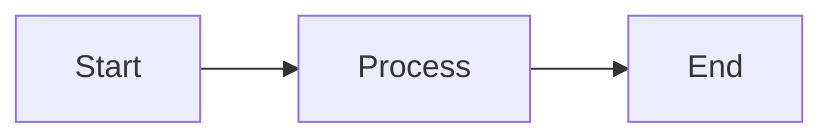

# Как создавалась документация проекта "Без шелухи"

## 📚 Обзор

Этот документ описывает методологию создания документации для Telegram-бота "Без шелухи" и как вы можете использовать этот подход для создания собственных ботов.

---

## 🎯 Цели документации

### 1. Полное описание продукта
- **Что делает бот**: Фильтрует информационный шум из Telegram-каналов
- **Кому нужен**: Пользователям, перегруженным информацией
- **Как решает проблему**: AI-фильтрация + персонализация + дайджесты

### 2. Техническая прозрачность
- **Архитектура**: C4-модель для визуализации структуры
- **Технологии**: Rails 8, Telegram Bot API, MTProto 2.0, AI/LLM
- **Интеграции**: Как компоненты взаимодействуют

### 3. Процесс разработки
- **Спецификации**: Что нужно сделать и зачем
- **Планы имплементации**: Как это сделать пошагово
- **TDD подход**: Сначала тесты, потом код

---

## 📂 Структура документации

```
docs/
├── Product/                    # Продуктовая документация
│   ├── bot-descriptions.md     # Продающие описания
│   ├── features.md             # Функциональность
│   ├── user-flow.md            # Пользовательские сценарии
│   ├── target-audience.md      # Целевая аудитория
│   └── problems.md             # Проблемы, которые решаем
│
├── Architecture/               # Архитектурная документация
│   └── c4-model.md             # C4 модель системы (4 уровня)
│
├── Specs/                      # Спецификации функционала
│   ├── 001_SettingsAgent_Specification.md
│   ├── 045_Telegram_Bot_Commands_Specification.md
│   └── ...
│
├── Implementation/             # Планы реализации
│   ├── Spec_001_SettingsAgent_Implementation.md
│   ├── Spec_045_Telegram_Bot_Commands_Implementation.md
│   └── ...
│
├── gems/                       # Документация по библиотекам
│   ├── telegram-bot.md         # Telegram Bot Ruby gem
│   └── ruby-llm.md             # Ruby LLM integration
│
├── Testing/                    # Тестирование
│   └── README.md               # Подходы к тестированию
│
├── Learning/                   # Обучающие материалы
│   └── How_Documentation_Was_Created.md  # Этот документ
│
├── ROADMAP.md                  # Дорожная карта проекта
└── Specification_Workflow_Guide.md  # Регламент работы
```

---

## 🔄 Жизненный цикл документа

### 1. Продуктовая фаза

#### A. Описание проблемы (`Product/problems.md`)
```markdown
# Проблема: Информационный шум в Telegram

## Описание
Пользователи подписаны на десятки каналов, но 80% контента:
- Реклама
- "Вода" и шелуха
- Дубликаты новостей
- Нерелевантная информация

## Последствия
- Тратят 40+ минут в день на просмотр
- Пропускают важное
- Стресс от информационной перегрузки
```

#### B. Целевая аудитория (`Product/target-audience.md`)
```markdown
# Целевая аудитория

## Основной сегмент: "Информационно перегруженные профессионалы"
- Возраст: 25-45
- Подписаны на 20+ каналов
- Ценят свое время
- Хотят быть в курсе, но эффективно
```

#### C. Функциональность (`Product/features.md`)
```markdown
# Функциональные возможности

## Основная цель
Полностью избавиться от информационного шума

## Основные фичи
1. Гибкая настройка частоты доставки
2. Разные форматы доставки контента
3. Социальная сеть каналов
4. Обучаемая система фильтрации
```

#### D. Пользовательский поток (`Product/user-flow.md`)
```markdown
# User Flow: Онбординг

## Шаг 1: /start
- Приветствие
- Объяснение ценности
- Кнопка "Начать"

## Шаг 2: Добавление каналов
- Пример: t.me/channelname
- Валидация
- Подтверждение
```

**Ключевой принцип**: Документация начинается с пользователя, а не с технологий!

---

### 2. Архитектурная фаза

#### C4 модель - 4 уровня абстракции

**Level 1: Context Diagram** - Система в окружении


**Level 2: Container Diagram** - Компоненты внутри системы


**Level 3: Component Diagram** - Детали компонентов


**Level 4: Code** - Реальный код
```ruby
class SettingsAgent
  def initialize(bot, user)
    @bot = bot
    @user = user
  end

  def show_settings
    # Реализация
  end
end
```

**Ключевой принцип**: От общего к частному, каждый уровень детализирует предыдущий.

---

### 3. Фаза спецификаций

#### Структура спецификации

```markdown
# Спецификация 001: SettingsAgent

## Мета информация
- Номер: 001
- Статус: approved
- Приоритет: P1

## Общее описание
Агент для управления настройками пользователя

## Функциональные требования
1. Отображение текущих настроек
2. Изменение настроек через inline-кнопки
3. Валидация входных данных

## Нефункциональные требования
- Время ответа < 500ms
- 100% test coverage
- Кеширование на 1 час

## Форматы данных
### Input
\`\`\`ruby
{ setting: 'delivery_frequency', value: 'real_time' }
\`\`\`

### Output
\`\`\`ruby
{ success: true, message: 'Настройка обновлена' }
\`\`\`

## Edge cases
- Невалидное название настройки
- Невалидное значение
- Проблемы с БД

## Критерии выполнения
- [ ] Все настройки отображаются
- [ ] Валидация работает
- [ ] Тесты покрывают 100%

## Статус: approved
```

**Статусы спецификации**:
- `draft` → `need_plan` → `approved` → `implemented` → `delivered`

---

### 4. Фаза планирования

#### Структура плана имплементации

```markdown
# Реализация Spec 001: SettingsAgent

## Обзор
Пошаговый план реализации с TDD подходом

## Этап 1: Подготовка (Tests First!)
- [ ] 1.1 Изучить существующий код
- [ ] 1.2 Проверить зависимости
- [x] 1.3 Создать тестовую среду ✅

## Этап 2: Создание тестов (RED)
- [ ] 2.1 Написать тест для initialize
- [ ] 2.2 Написать тест для show_settings
- [ ] 2.3 Убедиться что тесты падают ❌

## Этап 3: Реализация (GREEN)
- [ ] 3.1 Реализовать initialize
- [ ] 3.2 Реализовать show_settings
- [ ] 3.3 Убедиться что тесты проходят ✅

## Этап 4: Рефакторинг (REFACTOR)
- [ ] 4.1 Оптимизировать код
- [ ] 4.2 Добавить комментарии
- [ ] 4.3 Убедиться что тесты все еще проходят ✅
```

**TDD цикл**: RED → GREEN → REFACTOR

---

## 🛠️ Методология документирования

### 1. Product-First подход

**Последовательность**:
1. **Проблема** → Что не так сейчас?
2. **Решение** → Как мы это исправим?
3. **Пользователь** → Кто будет использовать?
4. **Сценарии** → Как они будут использовать?
5. **Функции** → Какие фичи нужны?

**Пример**:
```
❌ Плохо: "Создадим микросервис для агрегации данных"
✅ Хорошо: "Пользователь тратит 40 минут на просмотр каналов.
            Создадим фильтр, чтобы он получал только важное за 5 минут"
```

### 2. Architecture-as-Code

**C4 модель в Mermaid**:
```markdown

```

**Преимущества**:
- ✅ Визуализация в Markdown
- ✅ Версионируется в Git
- ✅ Автоматически обновляется
- ✅ Не требует специальных инструментов

### 3. Specification-Driven Development

**Регламент работы со спецификациями**:



**Каждый статус имеет**:
- Критерии входа
- Критерии выхода
- Ответственный
- Действия

### 4. Test-Driven Documentation

**Документация пишется как спецификация тестов**:

```markdown
## Acceptance Criteria

### Scenario: Пользователь просматривает настройки
**Given** пользователь "test_user"
**When** он вызывает /settings
**Then** он видит текущие настройки
**And** он видит inline клавиатуру
```

**Эти критерии превращаются в тесты**:
```ruby
describe '#settings!' do
  it 'показывает текущие настройки' do
    # Given
    user = create(:telegram_user)

    # When
    dispatch_command :settings

    # Then
    expect(last_message).to include('Настройки')
    expect(last_message).to have_inline_keyboard
  end
end
```

---

## 📚 Примеры документации

### Пример 1: Спецификация SettingsAgent

**Файл**: `docs/Specs/001_SettingsAgent_Specification.md`

**Что описывает**:
- Агент для управления настройками бота
- 3 типа настроек: частота, формат, строгость
- Валидация входных данных
- Performance требования < 500ms

**Ключевые разделы**:
1. Мета информация (номер, статус, приоритет)
2. Функциональные требования
3. Нефункциональные требования
4. Форматы данных (input/output)
5. Edge cases
6. Acceptance criteria
7. Критерии успеха

### Пример 2: План имплементации SettingsAgent

**Файл**: `docs/Implementation/Spec_001_SettingsAgent_Implementation.md`

**Что описывает**:
- 10 этапов реализации
- Tests First подход
- RED-GREEN-REFACTOR цикл
- Чекбоксы для отслеживания

**Ключевые принципы**:
1. **Этап 1-3**: Подготовка и анализ
2. **Этап 4**: Создание тестов (RED)
3. **Этап 5-7**: Реализация (GREEN)
4. **Этап 8-10**: Интеграция и тестирование

### Пример 3: ROADMAP

**Файл**: `docs/ROADMAP.md`

**Структура**:
```markdown
## Phase 1: MVP
### 1.1 Database Setup
- [x] Создать миграции ✅
- [x] Добавить индексы ✅

### 1.2 Telegram Bot
- [x] Настроить gem ✅
- [x] Создать контроллер ✅

### 1.3 AI Setup
- [x] Настроить ruby_llm ✅
- [x] Создать wrapper ✅
```

**Принципы ROADMAP**:
- Разбивка на фазы (Phase 1, 2, 3...)
- Каждая фаза на секции (1.1, 1.2, 1.3...)
- Чекбоксы для отслеживания
- Ссылки на спецификации

---

## 🎓 Как применить для своего бота

### Шаг 1: Определите проблему

**Template**:
```markdown
# Проблема: [Название]

## Описание
Пользователи сталкиваются с [проблема]

## Последствия
- [Последствие 1]
- [Последствие 2]

## Текущие решения
- [Решение 1]: не подходит потому что [причина]
- [Решение 2]: не подходит потому что [причина]

## Наше решение
[Как ваш бот решит эту проблему]
```

### Шаг 2: Опишите пользователей

**Template**:
```markdown
# Целевая аудитория

## Основной сегмент: [Название]
- Возраст: [диапазон]
- Профессия: [описание]
- Проблемы: [список]
- Цели: [список]

## Дополнительный сегмент: [Название]
[аналогично]
```

### Шаг 3: Спроектируйте user flow

**Template**:
```markdown
# User Flow: [Название процесса]

## Шаг 1: [Название]
```
[Пример сообщения]

[Кнопка 1]  [Кнопка 2]
```

## Шаг 2: [Название]
[Описание что происходит]

## Edge cases
- Что если пользователь нажмет отмену?
- Что если сеть недоступна?
```

### Шаг 4: Создайте архитектуру

**Template C4 Level 1**:
```markdown

```

### Шаг 5: Напишите спецификацию

**Template**:
```markdown
# Спецификация XXX: [Название]

## Мета информация
- Номер: XXX
- Статус: draft
- Приоритет: P1

## Общее описание
[1-2 предложения о функционале]

## Функциональные требования
1. [Требование 1]
2. [Требование 2]

## Нефункциональные требования
- Performance: [метрика]
- Security: [требование]

## Acceptance Criteria
**Given** [условие]
**When** [действие]
**Then** [результат]

## Статус: draft
```

### Шаг 6: Создайте план реализации

**Template**:
```markdown
# Реализация Spec XXX: [Название]

## Этап 1: Подготовка
- [ ] 1.1 Изучить [что]
- [ ] 1.2 Проверить [что]

## Этап 2: Тесты (RED)
- [ ] 2.1 Написать тест для [функция]
- [ ] 2.2 Убедиться что тесты падают ❌

## Этап 3: Реализация (GREEN)
- [ ] 3.1 Реализовать [функция]
- [ ] 3.2 Убедиться что тесты проходят ✅

## Этап 4: Рефакторинг
- [ ] 4.1 Оптимизировать
- [ ] 4.2 Документировать
```

---

## 🔧 Инструменты

### 1. Mermaid для диаграмм

**Установка**: Встроено в GitHub, GitLab, VS Code

**Примеры**:


### 2. I18n для текстов

**Структура**:
```yaml
# config/locales/ru.yml
ru:
  telegram_bot:
    settings:
      title: "⚙️ Настройки"
      delivery_frequency:
        label: "Частота доставки:"
        options:
          real_time: "В реальном времени"
          once_daily: "Раз в день"
```

### 3. Minitest для TDD

**Пример**:
```ruby
class SettingsAgentTest < ActiveSupport::TestCase
  test "shows settings" do
    agent = SettingsAgent.new(bot, user)
    agent.show_settings

    assert_includes last_message, 'Настройки'
  end
end
```

---

## 📊 Метрики качества документации

### Критерии хорошей документации

✅ **Полнота**:
- Все основные разделы присутствуют
- Нет пропущенных требований
- Edge cases продуманы

✅ **Актуальность**:
- Статус обновляется регулярно
- Ссылки работают
- Код соответствует описанию

✅ **Понятность**:
- Понятна новому разработчику
- Есть примеры
- Есть визуализация

✅ **Проверяемость**:
- Критерии измеримы
- Тесты соответствуют спецификациям
- Acceptance criteria проверяемы

### Проверка качества

```bash
# Все спецификации имеют статус?
grep -L "Статус:" docs/Specs/*.md

# Все планы завершены?
grep -c "\[x\]" docs/Implementation/*.md

# Есть ли битые ссылки?
find docs -name "*.md" -exec grep -H "\[.*\](.*)" {} \;
```

---

## 🎯 Ключевые принципы

### 1. Пользователь на первом месте
- Документация начинается с проблемы пользователя
- Технические детали вторичны
- User flow определяет архитектуру

### 2. От общего к частному
- Level 1: Система в окружении
- Level 2: Компоненты системы
- Level 3: Детали компонентов
- Level 4: Код

### 3. Tests First
- Спецификация → Acceptance criteria → Тесты → Код
- RED-GREEN-REFACTOR цикл
- 100% test coverage

### 4. Living Documentation
- Документация версионируется
- Обновляется вместе с кодом
- Диаграммы генерируются автоматически

### 5. Progressive Disclosure
- Каждый уровень детализирует предыдущий
- Можно начать с обзора
- Можно углубиться в детали

---

## 📝 Чеклист для создания документации

### Продуктовая фаза
- [ ] Описана проблема (`Product/problems.md`)
- [ ] Определена целевая аудитория (`Product/target-audience.md`)
- [ ] Перечислены функции (`Product/features.md`)
- [ ] Описан user flow (`Product/user-flow.md`)
- [ ] Созданы продающие описания (`Product/bot-descriptions.md`)

### Архитектурная фаза
- [ ] Level 1: Context Diagram
- [ ] Level 2: Container Diagram
- [ ] Level 3: Component Diagram
- [ ] Level 4: Code Examples

### Фаза спецификаций
- [ ] Создан файл спецификации
- [ ] Заполнены функциональные требования
- [ ] Заполнены нефункциональные требования
- [ ] Описаны форматы данных
- [ ] Продуманы edge cases
- [ ] Написаны acceptance criteria
- [ ] Установлен статус `draft` → `need_plan`

### Фаза планирования
- [ ] Создан план имплементации
- [ ] План разбит на этапы
- [ ] Включен TDD подход
- [ ] Добавлены чекбоксы
- [ ] Статус изменен на `approved`

### Фаза реализации
- [ ] Написаны тесты (RED)
- [ ] Реализован код (GREEN)
- [ ] Проведен рефакторинг (REFACTOR)
- [ ] Обновлены чекбоксы
- [ ] Статус изменен на `implemented`

---

## 🚀 Следующие шаги

1. **Изучите примеры** в этом проекте
2. **Создайте Product документацию** для своего бота
3. **Нарисуйте C4 диаграммы** архитектуры
4. **Напишите первую спецификацию**
5. **Создайте план имплементации** с TDD
6. **Реализуйте** согласно плану

---

## 📚 Связанные документы

- [Регламент работы со спецификациями](../Specification_Workflow_Guide.md)
- [ROADMAP проекта](../ROADMAP.md)
- [C4 модель архитектуры](../Architecture/c4-model.md)
- [Пример спецификации: SettingsAgent](../Specs/001_SettingsAgent_Specification.md)
- [Пример плана: SettingsAgent](../Implementation/Spec_001_SettingsAgent_Implementation.md)
- [Telegram Bot документация](../gems/telegram-bot.md)

---

**Дата создания**: 2025-11-15
**Автор**: AI Assistant на основе анализа проекта "Без шелухи"
**Статус**: Обучающий материал
