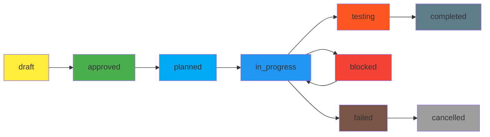

# Регламент работы со спецификациями NoFluff Bot

## 📋 Обзор

Документ описывает полный жизненный цикл работы со спецификациями проекта от создания до реализации.

**Что такое спецификация?** См. [Что такое спецификация в проекте](./What_Is_Specification.md)

## 🔄 Жизненный цикл спецификации


## 📊 Статусы спецификаций

### 🟡 **draft** - Черновик
- **Описание**: Начальная стадия, идеи еще формируются
- **Критерии**:
  - Базовая структура документа
  - Основные требования описаны
  - **Требует доработки** - неполное описание, missing детали
- **Действия**:
  - Дополнить недостающие разделы
  - Добавить детальные требования
  - Проработать edge cases
  - Определить бизнес-контекст и приоритет
- **Расположение**: `docs/Specs/XXX_Name_Specification.md`

### 🟠 **business_review** - Бизнес-проверка
- **Описание**: Спецификация готова к проверке бизнес-релевантности
- **Критерии**:
  - ✅ Все основные требования описаны
  - ✅ Бизнес-контекст определен
  - ✅ Приоритет установлен (P0-P3)
  - ✅ Метрики успеха определены
  - ❌ Требуется бизнес-approval
- **Действия**:
  - Провести бизнес-review
  - Проверить alignment с целями продукта
  - Утвердить приоритет и метрики
- **Ответственный**: Product Manager

### 🟠 **need_plan** - Требует план имплементации
- **Описание**: Спецификация готова и полная, но нет плана реализации
- **Критерии**:
  - ✅ Все требования описаны детально
  - ✅ Форматы данных определены
  - ✅ Edge cases продуманы
  - ✅ Требования безопасности учтены
  - ❌ Отсутствует план имплементации
- **Действия**:
  - Создать `docs/Implementation/Spec_XXX_Name_Implementation.md`
  - Разбить на этапы с TDD подходом
  - Добавить чекбоксы для отслеживания
- **Расположение**: `docs/Specs/XXX_Name_Specification.md`

### 🟣 **tech_review** - Техническая проверка
- **Описание**: План имплементации готов к технической проверке
- **Критерии**:
  - ✅ Бизнес-аспекты одобрены
  - ✅ План имплементации создан
  - ✅ TDD подход включен
  - ✅ Технические риски оценены
  - ❌ Требуется технический approval
- **Действия**:
  - Провести технический review
  - Проверить архитектурное решение
  - Утвердить технический подход
- **Ответственный**: Tech Lead

### 🟢 **approved** - Одобрена к реализации
- **Описание**: Полная спецификация с детальным планом имплементации
- **Критерии**:
  - ✅ Спецификация complete и детальная
  - ✅ Бизнес-approval получен
  - ✅ Технический approval получен
  - ✅ План имплементации создан
  - ✅ План разбит на этапы с чекбоксами
  - ✅ TDD подход включен
  - ✅ Все риски оценены и митигированы
- **Действия**:
  - Начать реализацию согласно плану
  - Отмечать выполненные пункты
  - Вести прогресс в чекбоксах
- **Расположение**: `docs/Specs/XXX_Name_Specification.md` + `docs/Implementation/Spec_XXX_Name_Implementation.md`

### 🔵 **in_progress** - В разработке
- **Описание**: Активная разработка функционала
- **Критерии**:
  - ✅ Спецификация одобрена
  - ✅ Разработка начата
  - 🔄 Часть пунктов плана выполнена
- **Действия**:
  - Регулярно обновлять прогресс в плане
  - Отмечать выполненные пункты
  - Сообщать о блокерах
- **Ответственный**: Developer

### 🔴 **testing** - Тестирование
- **Описание**: Код готов, идет фаза тестирования
- **Критерии**:
  - ✅ Все пункты плана выполнены
  - ✅ Unit тесты написаны и проходят
  - 🔄 Integration тесты в процессе
  - 🔄 Performance тесты проводятся
- **Действия**:
  - Проводить комплексное тестирование
  - Фиксить найденные баги
  - Готовить к продакшен
- **Ответственный**: QA Engineer + Developer

### 🔵 **implemented** - Реализована
- **Описание**: Функционал полностью реализован и протестирован
- **Критерии**:
  - ✅ Все пункты плана выполнены
  - ✅ Все тесты проходят
  - ✅ Бизнес-метрики достигнуты
  - ✅ Функционал работает в production/staging
  - ✅ ROADMAP обновлен (если применимо)
- **Действия**:
  - Поставить галочку в ROADMAP.md
  - Создать summary документ (опционально)
  - Архивировать рабочие материалы
- **Расположение**: `docs/Implemented/` (опционально для архивации)

### 🟤 **delivered** - Доставлена в продакшен
- **Описание**: Функционал работает в production и доступен пользователям
- **Критерии**:
  - ✅ Деплой успешно завершен
  - ✅ Мониторинг настроен
  - ✅ Первые пользователи используют функционал
  - ✅ Обратная связь собирается
- **Действия**:
  - Мониторить производительность
  - Собирать user feedback
  - Анализировать бизнес-метрики
  - Планировать улучшения
- **Ответственный**: Product Manager + DevOps

## 📁 Структура файлов

### Спецификация
```
docs/Specs/XXX_Name_Specification.md
├── ## Первоначальный запрос
├── ## Обзор
├── ## Функциональные требования
├── ## Нефункциональные требования
├── ## Требования безопасности
├── ## Format данных
├── ## Edge cases
├── ## Критерии выполнения
├── ## Статус: [draft|need_plan|approved|implemented]
└── ## Связанные документы
```

### План имплементации
```
docs/Implementation/Spec_XXX_Name_Implementation.md
├── ## Обзор
├── ## Ссылка на спецификацию
├── ## Этап 1: Подготовка (Tests First)
│   ├── - [ ] 1.1 Создать тесты...
│   ├── - [ ] 1.2 Создать модель...
│   └── - [x] 1.3已完成...
├── ## Этап 2: Реализация
├── ## Этап 3: Тестирование
├── ## Этап 4: Интеграция
└── ## Критерии выполнения
```

## 🔄 Процесс работы

### 1. Создание новой спецификации
```bash
# 1. Найти следующий номер
ls docs/Specs/ | sort -V | tail -1

# 2. Создать файл
touch docs/Specs/XXX_Name_Specification.md

# 3. Установить статус
Статус: draft
```

### 2. Продвижение по статусам
```bash
# draft → need_plan
# Когда спецификация complete:
Статус: need_plan

# need_plan → approved
# После создания плана:
Статус: approved

# approved → implemented
# После реализации всех пунктов:
Статус: implemented
```

### 3. Обновление ROADMAP
```markdown
# При изменении статуса обновить ROADMAP.md:
- [x] Создать спецификацию `docs/Specs/XXX_Name_Specification.md` ✅ approved
- [ ] Создать план реализации `docs/Implementation/Spec_XXX_Name_Implementation.md`
- [ ] Реализовать согласно плану
```

## 📋 Чеклист качества

### ✅ Спецификация готова к переходу в need_plan:
- [ ] Первоначальный запрос зафиксирован
- [ ] Все функциональные требования описаны
- [ ] Нефункциональные требования определены
- [ ] Требования безопасности учтены
- [ ] Форматы данных четко определены
- [ ] Edge cases продуманы
- [ ] Критерии выполнения измеримы

### ✅ План имплементации готов к переходу в approved:
- [ ] План разбит на логические этапы
- [ ] Каждый этап имеет конкретные задачи с чекбоксами
- [ ] TDD подход включен (тесты первыми)
- [ ] Задачи измеримы и проверяемы
- [ ] Учтены зависимости между этапами

### ✅ Спецификация реализована (implemented):
- [ ] Все пункты плана отмечены как выполненные
- [ ] Код соответствует спецификации
- [ ] Тесты покрывают функционал
- [ ] Функционал работает в intended environment
- [ ] Документация обновлена

## 🔧 Инструменты и автоматизация

### 1. Rake Tasks для работы со спецификациями

**Генерация новых спецификаций:**
```bash
# Создать новую спецификацию
rake specs:generate[feature_name]

# Примеры:
rake specs:generate[user_analytics]
rake specs:generate[channel_recommendations]
```

**Управление статусами:**
```bash
# Обновить статус спецификации
rake specs:update_status[048,approved]

# Доступные статусы: draft, business_review, need_plan, tech_review, approved, in_progress, testing, implemented, delivered
```

**Создание планов реализации:**
```bash
# Создать план реализации для спецификации
rake specs:create_plan[048]
```

**Валидация и качество:**
```bash
# Проверить качество спецификации
rake specs:validate[048]

# Показать все спецификации с статусами
rake specs:list

# Сгенерировать отчет по качеству
rake specs:quality_report
```

### 2. Проверка статусов (legacy)
```bash
# Показать все спецификации и их статусы
grep -r "Статус:" docs/Specs/

# Показать незавершенные планы
grep -r "\[ \]" docs/Implementation/

# Показать выполненные планы
grep -r "\[x\]" docs/Implementation/
```

### 3. Валидация структуры (automated)
```bash
# Проверить наличие необходимых разделов
for spec in docs/Specs/*.md; do
  echo "=== $spec ==="
  grep -E "^## (Обзор|Бизнес-контекст|Функциональные|Статус)" "$spec" || echo "❌ Missing sections"
done
```

### 4. Отчет по прогрессу
```bash
# Создать отчет по всем спецификациям
echo "# Спецификации проекта"
echo "Всего: $(ls docs/Specs/ | wc -l)"
echo "Draft: $(grep -l "Статус: draft" docs/Specs/* | wc -l)"
echo "Business Review: $(grep -l "Статус: business_review" docs/Specs/* | wc -l)"
echo "Need Plan: $(grep -l "Статус: need_plan" docs/Specs/* | wc -l)"
echo "Tech Review: $(grep -l "Статус: tech_review" docs/Specs/* | wc -l)"
echo "Approved: $(grep -l "Статус: approved" docs/Specs/* | wc -l)"
echo "In Progress: $(grep -l "Статус: in_progress" docs/Specs/* | wc -l)"
echo "Testing: $(grep -l "Статус: testing" docs/Specs/* | wc -l)"
echo "Implemented: $(grep -l "Статус: implemented" docs/Specs/* | wc -l)"
```

## 📝 Шаблоны

### Шаблон спецификации
```markdown
# Спецификация XXX: Название

## Первоначальный запрос
> Исходный запрос пользователя/заказчика, который стал основой для создания этой спецификации.
>
> **Важно:** Сохраняйте оригинальную формулировку запроса, чтобы не терять первоначальную цель и контекст создания спецификации.

## Обзор
Краткое описание функционала и его цели.

## Функциональные требования
1. **Требование 1**: Детальное описание
2. **Требование 2**: Детальное описание

## Нефункциональные требования
1. **Производительность**: ...
2. **Масштабируемость**: ...
3. **Надежность**: ...

## Требования безопасности
1. **Аутентификация**: ...
2. **Авторизация**: ...
3. **Защита данных**: ...

## Форматы данных
### Input
```json
{
  "field": "type"
}
```

### Output
```json
{
  "result": "type"
}
```

## Edge cases
1. **Сценарий 1**: Как обрабатывать...
2. **Сценарий 2**: Как обрабатывать...

## Критерии выполнения
- [ ] Требование 1 реализовано
- [ ] Требование 2 реализовано
- [ ] Все тесты проходят
- [ ] Производительность соответствует требованиям

## Статус: draft

## Связанные документы
- [План реализации](../Implementation/Spec_XXX_Name_Implementation.md)
- [ROADMAP](../ROADMAP.md)
```

## 🎯 Лучшие практики

### 1. Naming conventions
- Спецификации: `XXX_Name_Specification.md`
- Планы: `Spec_XXX_Name_Implementation.md`
- XXX = трехзначный номер с ведущими нулями

### 2. Версионирование
- При изменениях обновлять `version` и `updated_at`
- Вести changelog для значительных изменений

### 3. Коллаборация
- Перед approval обязательно code review
- Использовать pull requests для изменений
- Документировать решения в комментариях

### 4. Трейкинг
- Регулярно обновлять статусы
- Еженедельно проверять progress
- При блокировках создавать issue

---

## 📋 Статусы планов имплементации

### 🔄 Workflow планов имплементации



### 📝 **Planning Phase**

#### 🟡 **draft** - Черновик плана
- **Описание**: Начальная стадия планирования
- **Критерии**:
  - Базовая структура плана определена
  - Основные задачи описаны
  - **Требует доработки** - missing детали, dependencies не определены
- **Действия**:
  - Детализировать задачи и сроки
  - Определить зависимости
  - Проработать риски
  - Добавить success metrics
- **Расположение**: `docs/Implementation/Spec_XXX_Phase_Name.md`

#### 🟢 **approved** - Утвержден
- **Описание**: План утвержден и готов к исполнению
- **Критерии**:
  - Все задачи детализированы
  - Dependencies определены
  - Success metrics установлены
  - Timeline реалистичный
- **Действия**:
  - Перенести в backlog для планирования
  - Подготовить окружение
  - Зарезервировать ресурсы
- **Следующий статус**: `planned`

#### 🔵 **planned** - Запланирован
- **Описание**: План запланирован в бэклог, готов к началу
- **Критерии**:
  - Включен в work schedule
  - Ресурсы выделены
  - Dependencies разрешены
- **Действия**:
  - Начать выполнение в запланированное время
  - Следить за progress
- **Следующий статус**: `in_progress`

### 🚀 **Execution Phase**

#### 🔷 **in_progress** - В процессе выполнения
- **Описание**: Активная работа над планом
- **Критерии**:
  - Первая задача начата
  - Progress tracking активен
  - Регулярные обновления статуса
- **Действия**:
  - Выполнять задачи согласно плану
  - Отслеживать progress
  - Решать проблемы по мере возникновения
  - Обновлять статус регулярно
- **Следующий статус**: `testing` или `completed`

#### 🟠 **testing** - На стадии тестирования
- **Описание**: Основной функционал реализован, идет тестирование
- **Критерии**:
  - Основные задачи выполнены
  - Unit тесты написаны
  - Integration тесты запущены
- **Действия**:
  - Запустить все тесты
  - Провести QA проверку
  - Исправить найденные проблемы
  - Подготовить к delivery
- **Следующий статус**: `completed`

#### 🟢 **completed** - Завершен успешно
- **Описание**: План успешно завершен
- **Критерии**:
  - Все задачи выполнены
  - Все тесты проходят
  - Success metrics достигнуты
  - Документация обновлена
- **Действия**:
  - Провести финальный review
  - Обновить документацию
  - Создать总结 и lessons learned
  - Перейти к следующему плану
- **Следующий статус**: `delivered` (если применимо)

### ⚠️ **Problem Handling**

#### 🔴 **blocked** - Заблокирован
- **Описание**: Выполнение заблокировано внешними зависимостями
- **Критерии**:
  - Невозможно продолжить без external inputs
  - Dependencies не разрешены
  - Resources недоступны
- **Действия**:
  - Идентифицировать блокирующие факторы
  - Создать plan для разблокировки
  - Регулярно проверять статус блокировок
  - Рассмотреть альтернативные пути
- **Следующий статус**: `in_progress` (когда разблокирован)

#### 🟤 **failed** - Провалено
- **Описание**: Выполнение провалено, требуется пересмотр подхода
- **Критерии**:
  - Критические ошибки невозможно исправить
  - Timeline significantly exceeded
  - Success metrics недостижимы
- **Действия**:
  - Провести root cause analysis
  - Оценить возможность recovery
  - Создать новый план или отменить
  - Document lessons learned
- **Следующий статус**: `cancelled` или `draft` (новая версия)

#### ⚫ **cancelled** - Отменен
- **Описание**: План отменен, выполнение прекращено
- **Критерии**:
  - Бизнес-требования изменились
  - Приоритеты сменились
  - Провал выполнения (from `failed`)
- **Действия**:
  - Архивировать план
  - Document причины отмены
  - Обновить stakeholders
  - Освободить ресурсы
- **Финальный статус**

### 📊 **Tracking и управление**

#### **Обновление статусов:**
```bash
# В шапке плана имплементации
## Статус: in_progress
## Последнее обновление: 2025-01-31
## Ответственный: Данил Письменный
```

#### **Автоматический tracking:**
```bash
# Показать активные планы
grep -r "Статус:.*in_progress\|planned\|testing" docs/Implementation/

# Показать заблокированные планы
grep -r "Статус:.*blocked" docs/Implementation/

# Показать завершенные планы
grep -r "Статус:.*completed" docs/Implementation/
```

#### **Regular reviews:**
- **Ежедневно**: Проверять `in_progress` планы
- **Еженедельно**: Review `blocked` и `testing` планы
- **Ежемесячно**: Review `completed` планы и lessons learned

### 🎯 **Best Practices для планов имплементации**

1. **One status at a time** - каждый план имеет только один текущий статус
2. **Regular updates** - обновлять статус при значительных изменениях
3. **Clear criteria** - понятные критерии для каждого статуса
4. **Problem resolution** - активно работать с `blocked` и `failed` статусами
5. **Documentation** - document lessons learned для `completed` и `failed` планов

---

**📍 Где искать этот регламент:**
1. `docs/Specification_Workflow_Guide.md` - основной файл
2. `docs/README.md` - ссылка в основном описании
3. `.claude/CLAUDE.md` - инструкция для AI
4. Каждый раз при создании новой спецификации ссылаться на этот документ

**🔄 Последнее обновление:** 2025-01-31 (добавлены статусы планов имплементации)
**🔄 Последнее обновление:** 2025-11-02 (добавлен раздел "Первоначальный запрос" для сохранения исходного контекста)