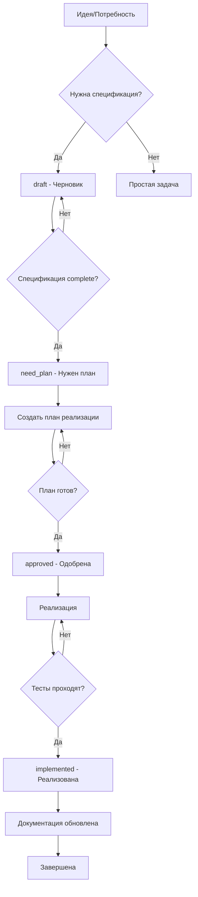

# Что такое спецификация в проекте NoFluff Bot

## 🎯 Определение

**Спецификация** в проекте NoFluff Bot - это **детальный технический документ**, который описывает функциональные и нефункциональные требования к определенной фиче или компоненту системы. Спецификация служит **единым источником правды** для разработчиков, тестировщиков и стейкхолдеров.

## 📋 Назначение спецификации

### 1. **Единый источник правды**
- Все участники работают с одинаковыми требованиями
- Избавляемся от разногласий и недопонимания
- Четкое определение что именно нужно сделать

### 2. **План для разработки**
- Конкретные шаги для реализации
- Измеримые критерии выполнения
- Предотвращение scope creep (расползания требований)

### 3. **Основа для тестирования**
- Четкие критерии что считать "сделано"
- Основа для написания тестов
- Проверка соответствия реализации требованиям

### 4. **Документация для будущего**
- Понимание почему решения были приняты
- Основа для рефакторинга и улучшений
- Онбординг новых разработчиков

## 🏗️ Структура спецификации

### Обязательные разделы
1. **Обзор** - Краткое описание и цели
2. **Функциональные требования** - Что система должна делать
3. **Нефункциональные требования** - Как система должна работать
4. **Требования безопасности** - Защита и ограничения доступа
5. **Форматы данных** - Структура входных/выходных данных
6. **Критерии выполнения** - Когда считать работу завершенной

### Дополнительные разделы
- **Edge cases** - Особые ситуации и их обработка
- **API/Interface** - Внешние интерфейсы
- **Зависимости** - Связи с другими компонентами
- **Риски** - Потенциальные проблемы и митигация

## 🔄 Жизненный цикл спецификации

```
Идея → Черновик → Утверждение → Реализация → Тестирование → Завершение
```

### Детальная схема


## 📝 Когда нужна спецификация

### ✅ **Обязательно нужна спецификация:**
- **Новая фича** - значительная функциональность
- **Изменение архитектуры** - затрагивает несколько компонентов
- **Интеграция с внешним сервисом** - API, webhooks, сторонние сервисы
- **Изменение бизнес-логики** - правила работы системы
- **Работа с данными** - новые модели, миграции, связи
- **Безопасность** - аутентификация, авторизация, шифрование

### ❌ **Спецификация не нужна:**
- **Исправление бага** - очевидная проблема с очевидным решением
- **Рефакторинг** - улучшение кода без изменения функциональности
- **Мелкая правка** - изменение текста, цвета, расположения
- **Оптимизация** - улучшение производительности без изменения логики
- **Обновление зависимостей** - upgrade версий gem-ов

### 🤔 **Нужно обсудить:**
- **Неоднозначные требования** - несколько возможных решений
- **Комплексная задача** - затрагивает несколько областей
- **Риски** - потенциальные проблемы с реализацией

## 📊 Уровни детализации

### Level 1: Lightweight (1-2 часа)
```
Название: Простая команда бота
Разделы: Обзор, Функциональные требования, Критерии выполнения
Размер: 1-2 страницы
Пример: /help команда с описанием всех команд
```

### Level 2: Standard (4-8 часов)
```
Название: Средняя сложность фича
Разделы: Все обязательные + API, Edge cases
Размер: 3-5 страниц
Пример: Система подписок на каналы
```

### Level 3: Comprehensive (1-2 дня)
```
Название: Сложная система/архитектура
Разделы: Все разделы + Dependencies, Риски, Performance
Размер: 5-10+ страниц
Пример: AI система классификации контента
```

## ✨ Качественная спецификация

### Признаки хорошей спецификации:
1. **Конкретная** - никаких "может быть", "возможно"
2. **Измеримая** - можно проверить что реализовано
3. **Полная** - все важные аспекты описаны
4. **Согласованная** - нет противоречий
5. **Понятная** - доступна для всех участников
6. **Актуальная** - отражает текущие требования

### Пример хорошего требования:
```
❌ Плохо: "Система должна быстро обрабатывать запросы"
✅ Хорошо: "Система должна обрабатывать API запросы за <200ms в 95% случаев,
            при нагрузке до 1000 RPS"
```

## 🔄 Процесс создания

### 1. **Инициация**
- Определить необходимость спецификации
- Выбрать уровень детализации
- Назначить ответственного

### 2. **Сбор требований**
- Поговорить со стейкхолдерами
- Изучить существующую систему
- Определить зависимости

### 3. **Написание черновика**
- Использовать шаблон `docs/Specification_Template.md`
- Заполнить все разделы
- Добавить примеры

### 4. **Ревью и утверждение**
- Внутреннее ревью команды
- Обсуждение с архитектором/lead
- Утверждение к реализации

### 5. **Планирование**
- Создать план имплементации
- Разбить на задачи с чекбоксами
- Оценить сроки и риски

## 📋 Примеры спецификаций в проекте

### Простая спецификация:
```
Spec_049_Debug_Command_Specification.md
- Команда /debug для администраторов
- Показывает системную информацию
- Простой план реализации
```

### Стандартная спецификация:
```
Spec_003_Subscription_Free_Channels_Specification.md
- Система подписок на каналы
- Лимиты для бесплатных пользователей
- Модели, API, бизнес-логика
```

### Комплексная спецификация:
```
Spec_046_Bot_Channel_Join_Process_Specification.md
- Процесс присоединения бота к каналам
- State machine, ошибки, уведомления
- Интеграция с Telegram API
```

## 🎯 Лучшие практики

### ✅ **Делай:**
- Используй шаблон для consistency
- Добавляй конкретные примеры
- Описывай edge cases
- Определяй критерии выполнимости
- Обновляй статус при изменениях

### ❌ **Не делай:**
- Пиши слишком общие формулировки
- Забывай про обработку ошибок
- Игнорируй нефункциональные требования
- Создавай спецификацию после реализации
- Забывай про security аспекты

## 🔗 Связанные документы

- [Регламент работы со спецификациями](./Specification_Workflow_Guide.md)
- [Шаблон спецификации](./Specification_Template.md)
- [Процесс TDD](./Implementation/tdd-for-telegram-agents.md)
- [Архитектура проекта](./Architecture/c4-model.md)

---

**💡 Запомни:** Спецификация - это не бюрократия, а инструмент для создания качественного программного обеспечения. Хорошая спецификация экономит время на этапе разработки и предотвращает дорогостоящие ошибки.