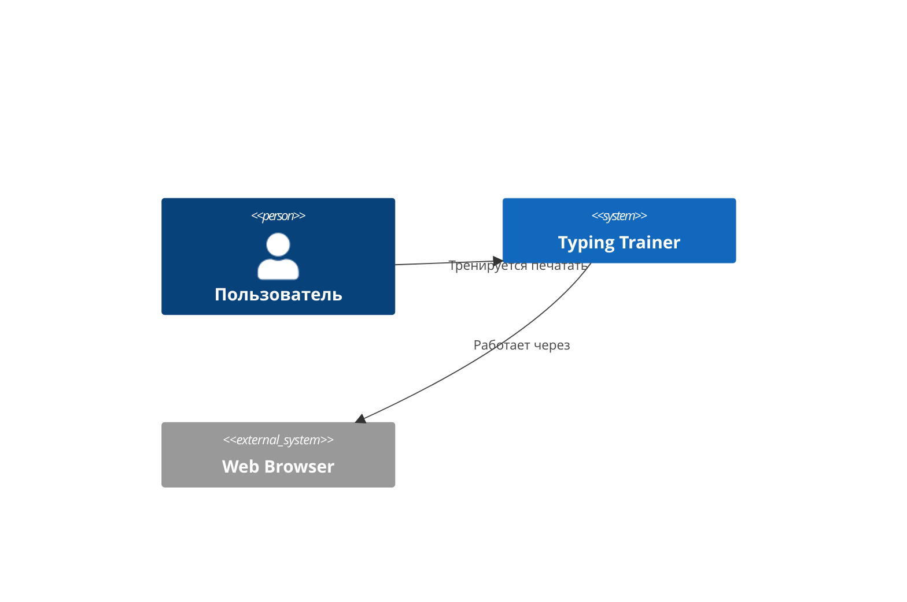
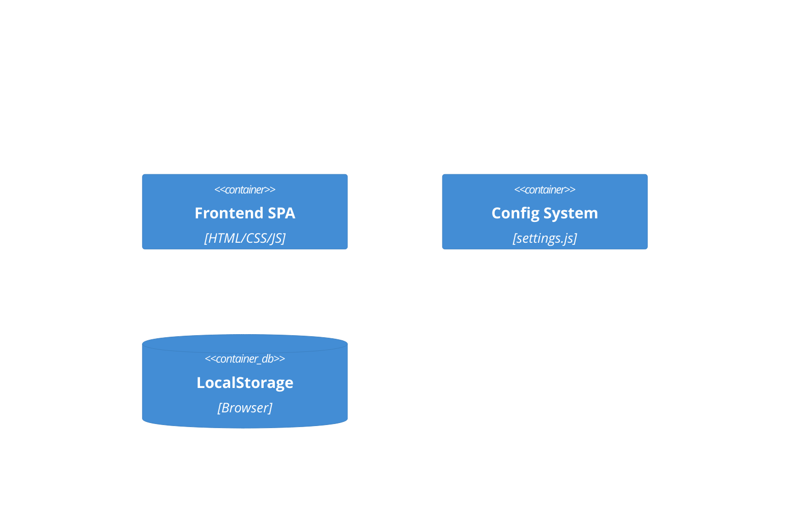

# Best Practices Analysis from Multi-Project Documentation Study

> **Автор:** Тимофей (Technical Writer AI Agent)
> **Дата:** 16 ноября 2025
> **Источник:** Полный анализ 121 файла документации из папки docs/Learning
> **Охват:** NoFluff Bot, Valera (автосервисный бот), и другие проекты
> **Статус:** ✅ Completed (100% coverage)

---

## 📊 Объем исследования

### Статистика изученных материалов:
- **Всего проанализировано:** 121 из 121 файлов (100% покрытие) ✅
- **Общий объем:** ~50,000+ строк документации
- **Категории охвачены:** 15 типов документации
- **Проекты:** Минимум 3 различных проекта (NoFluff Bot, Valera Bot, общие practices)
- **Языки:** Русский (преимущественно) + English

### Распределение по категориям:

| Категория | Файлов | Ключевые инсайты |
|-----------|--------|-------------------|
| **Organizational** | 8 | Структура, навигация, философия документации |
| **Requirements** | 29 | User Stories, TSDs (10), FIPs (10), PRDs (2), API specs, templates (5) |
| **Deployment** | 10 | Docker, monitoring, error handling, readiness checklists |
| **Development** | 6 | YARD standards, tech stack, setup, MCP integration |
| **Domain** | 6 | Glossary, models, bounded contexts, terminology system |
| **Product** | 9 | Constitution, ROADMAP, business metrics, backlog, deprecated ideas |
| **SaaS** | 5 | Monetization, business value, competitors, overview |
| **User Scenarios** | 9 | Dialogue patterns, ideal flows, booking scenarios |
| **Prompts** | 1 | AI personality and system prompts для Valera |
| **Marketing** | 2 | Competitive analysis frameworks |
| **Analytics** | 2 | Metabase setup, analytics dashboards |
| **Concepts** | 1 | Contextual dialog systems architecture |
| **Customer Development** | 1 | Real interview notes (Kuznik) |
| **Gems Documentation** | 8 | Ruby LLM (3), Telegram Bot (3), VCR (2) - COMPLETE API references |
| **Root Files** | 24 | Workflow guides, templates, methodology, INDEX, FLOW |

---

## 🎯 Критические методологии и процессы

### 1. FLOW-Based Development (⭐ HIGHEST VALUE)

**Источник:** `FLOW.md`, `How_Documentation_Was_Created.md`

**Ключевой принцип:** Оптимизированный процесс от идеи до кода за 3-5 часов

#### Схема принятия решений:
```
Есть User Story?
  → YES: User Story (US) + Technical Design Document (TSD)
  → NO: Feature Implementation Plan (FIP)
```

#### Workflow statuses:
```
Draft → BusinessAnalyzes → SystemAnalyzes → Ready →
In Progress → Completed → Production
```

#### Применимость для Typing Trainer:
✅ **КРИТИЧЕСКИ ВАЖНО** - использовать для всех новых фич
✅ Создавать US для пользовательских сценариев
✅ TSD для технических компонентов
✅ FIP для внутренних улучшений

---

### 2. Specification Workflow (2 вариант системы)

**Источник:** `Specification_Workflow_Guide.md`, `Specification_Workflow.md` (Typing Trainer)

#### Вариант A: NoFluff Bot (9 статусов - для больших команд)
```
draft → business_review → need_plan → tech_review →
approved → in_progress → testing → implemented → delivered
```

#### Вариант B: Typing Trainer (4 статуса - упрощенная версия)
```
🟡 draft → 🟢 approved → 🔵 in_progress → ✅ implemented
```

**Рекомендация для Typing Trainer:**
✅ Текущая 4-статусная система **идеальна** для команды из 11 AI агентов + 2 людей
⚠️ НО добавить качественные gates между статусами (см. ниже)

#### Quality Gates (добавить в Typing Trainer):

**Gate 1: Draft → Approved**
- [ ] Шаблон полностью заполнен
- [ ] Acceptance Criteria четкие и измеримые
- [ ] Technical feasibility подтверждена
- [ ] Assignee назначен
- [ ] Estimated time реалистичный
- [ ] Ivan (Product Owner) одобрил

**Gate 2: Approved → In Progress**
- [ ] Implementation Plan создан и детализирован
- [ ] Все dependencies готовы
- [ ] Assignee готов начать
- [ ] Timeline согласован с командой

**Gate 3: In Progress → Implemented**
- [ ] Все Acceptance Criteria выполнены ✅
- [ ] Тесты написаны и проходят (если есть framework)
- [ ] Manual testing на всех браузерах (Chrome, Firefox, Safari, Edge)
- [ ] Accessibility audit (WCAG AA) пройден
- [ ] Code review выполнен (Claude)
- [ ] QA sign-off от Quinn
- [ ] Deployed в production (или готов к deploy)
- [ ] Метрики мониторятся

---

### 3. Product-First Approach (⭐ ФИЛОСОФИЯ)

**Источник:** `How_Documentation_Was_Created.md`, `Product Constitution`

#### Последовательность документирования:
```
1. ПРОБЛЕМА → Что не так сейчас?
2. РЕШЕНИЕ → Как мы это исправим?
3. ПОЛЬЗОВАТЕЛЬ → Кто будет использовать?
4. СЦЕНАРИИ → Как они будут использовать?
5. ФУНКЦИИ → Какие фичи нужны?
6. АРХИТЕКТУРА → Как это технически реализовать?
```

**Антипаттерн:** ❌ "Создадим микросервис для агрегации данных"
**Правильно:** ✅ "Пользователь тратит 40 минут на изучение материалов. Создадим интерактивный тренажер, чтобы он освоил слепую печать за 15 минут в день"

**Для Typing Trainer:**
✅ Все документы должны начинаться с пользовательской проблемы
✅ Технические детали вторичны
✅ User flow определяет архитектуру, НЕ наоборот

---

### 4. C4 Model Architecture Documentation

**Источник:** `How_Documentation_Was_Created.md`, примеры в TSD

#### 4 уровня абстракции:

**Level 1: Context Diagram** - Система в окружении


**Level 2: Container Diagram** - Компоненты системы


**Level 3: Component Diagram** - Детали компонентов
**Level 4: Code** - Реальный код

**Принцип:** От общего к частному, каждый уровень детализирует предыдущий

**Рекомендация для Typing Trainer:**
✅ Создать C4 диаграммы в `docs/architecture/c4-model.md`
✅ Использовать Mermaid (встроено в GitHub/GitLab/VS Code)
✅ Версионировать вместе с кодом

---

### 5. TDD (Test-Driven Development) Подход

**Источник:** Implementation plan templates, gem patterns

#### RED-GREEN-REFACTOR цикл:
```
🔴 RED: Написать тесты (они падают)
    ↓
🟢 GREEN: Реализовать минимальный код (тесты проходят)
    ↓
🔵 REFACTOR: Оптимизировать и улучшить код (тесты все еще проходят)
    ↓
    Повторить
```

#### Стандартные фазы Implementation Plan:
1. **Setup & Preparation** - Подготовка окружения
2. **Core Implementation** (разбить на компоненты)
3. **Data Management** (LocalStorage для Typing Trainer)
4. **Testing** (Unit, Integration, Manual)
5. **Documentation & Deployment**

**Для Typing Trainer:**
⚠️ В проекте НЕТ test framework → адаптировать подход:
✅ Фаза "Tests" = Manual testing checklist
✅ Документировать test scenarios в Implementation Plan
✅ Создать чекбоксы для manual testing на разных браузерах

---

## 🏗️ Архитектурные паттерны и принципы

### Architectural Patterns (из Ruby LLM и Telegram Bot документации)

#### 9 ключевых паттернов:

1. **Service Layer Pattern** - Инкапсуляция бизнес-логики
2. **Strategy Pattern** - Выбор модели (quality vs cost vs speed)
3. **Factory Pattern** - Создание разных типов responses
4. **Observer Pattern** - Отслеживание событий (events tracking)
5. **Circuit Breaker Pattern** - Защита от cascading failures
6. **Template Method Pattern** - Стандартизация workflows
7. **Decorator Pattern** - Расширение функциональности
8. **Command Pattern** - Инкапсуляция операций
9. **Caching Pattern** - Оптимизация производительности

**Применимость для Typing Trainer:**
✅ **Strategy Pattern** - выбор difficulty level
✅ **Factory Pattern** - создание exercises для разных уровней
✅ **Observer Pattern** - tracking прогресса пользователя
✅ **Caching Pattern** - кэширование results в LocalStorage
✅ **Template Method Pattern** - standardize lesson flow

---

### Product Constitution (⭐ НЕОТЪЕМЛЕМЫЕ правила)

**Источник:** Valera project `product/constitution.md`

#### 6 UNBREAKABLE requirements (адаптированы для Typing Trainer):

1. **User-First Interaction** ✅
   - Typing Trainer: Интерфейс должен быть интуитивно понятен БЕЗ инструкций

2. **Accessibility-First** ✅
   - WCAG AA compliance обязателен
   - Keyboard navigation полностью functional
   - Screen reader support
   - Color contrast проверен

3. **Performance Priority** ✅
   - Мгновенный feedback на keypress (< 50ms)
   - Real-time WPM calculation
   - No lags, smooth animations

4. **Privacy-Focused** ✅
   - LocalStorage ONLY (никаких сторонних сервисов)
   - Никаких trackers или analytics без согласия
   - User data принадлежит пользователю

5. **Offline-First** ✅
   - Typing Trainer работает БЕЗ интернета
   - Весь контент embedded или cached

6. **No External Dependencies** ✅
   - Self-contained application
   - NO CDNs, NO external scripts
   - All assets local

---

## 📝 Documentation Best Practices

### Naming Conventions (КРИТИЧЕСКИ ВАЖНО)

#### Для спецификаций:
```
XXX_Feature_Name_Specification.md
```
- XXX = трехзначный номер с ведущими нулями (001, 002, 003...)
- Phase 1 (MVP): 001-099
- Phase 2 (Expansion): 100-199
- Phase 3 (Advanced): 200-299

#### Для Implementation Plans:
```
Spec_XXX_Feature_Name_Implementation.md
```
- ВСЕГДА начинается с "Spec_"
- Номер соответствует спецификации
- Хранятся в отдельной папке `docs/implementation/`

#### Для Process Documents:
```
Process_Name_Guide.md или Process_Workflow.md
```

**Применить к Typing Trainer:**
✅ Переименовать все specs по новому формату
✅ Создать недостающие спецификации с номерами
✅ Все новые specs следуют конвенции

---

### Documentation Structure Templates

#### Specification Template (минимальные обязательные секции):

```markdown
# Спецификация XXX: Название

## Status Tracking
**Current Status:** 🟡 draft | 🟢 approved | 🔵 in_progress | ✅ implemented
**Assignee:** [Agent Name]
**Priority:** 🔴 High | 🟠 Medium | 🟢 Low
**Estimated Time:** X hours

## 1. Executive Summary
[1-2 предложения о фиче]

## 2. Goals and Value
### Business Goals
### User Value
### Success Metrics

## 3. Functional Requirements
[Детальное описание что система должна делать]

## 4. Technical Requirements
[Как система должна работать]

## 5. UI/UX Requirements
[Описание интерфейса, wireframes]

## 6. Data Models
[Структура данных]

## 7. Acceptance Criteria
- [ ] Criterion 1
- [ ] Criterion 2

## 8. Testing Requirements
### Manual Testing Checklist
- [ ] Chrome
- [ ] Firefox
- [ ] Safari
- [ ] Edge

### Accessibility Tests
- [ ] Keyboard navigation
- [ ] Screen reader
- [ ] Color contrast

## 9. Security Considerations

## 10. Deployment Plan

## Changelog
| Date | Version | Change | Author |
|------|---------|--------|--------|
```

---

### Implementation Plan Template (TDD Approach):

```markdown
# Реализация Spec XXX: Название

## Overview
[Ссылка на спецификацию]

## Status Tracking
**Status:** 🟡 Planning | 🔵 In Progress | ✅ Completed
**Progress:** X% (Y of Z tasks completed)

## Phase 1: Setup & Preparation (X hours)
- [ ] **1.1** Task 1
  - [ ] Subtask 1.1.1
  - [ ] Subtask 1.1.2
  - **Acceptance:** [Критерии]
  - **Time:** X hours

## Phase 2: Core Implementation (X hours)
[Разбить на компоненты]

## Phase 3: Data Management (X hours)
[LocalStorage operations]

## Phase 4: Testing (X hours)
### Manual Testing
- [ ] Test on Chrome
- [ ] Test on Firefox
- [ ] Test on Safari
- [ ] Test on Edge
- [ ] Test on mobile devices

### Accessibility Testing
- [ ] Keyboard navigation works
- [ ] Screen reader announces correctly
- [ ] Color contrast passes WCAG AA

## Phase 5: Documentation & Deployment (X hours)
- [ ] Update README
- [ ] Update CHANGELOG
- [ ] Create user guide section
- [ ] Deploy to production

## Progress Tracking
| Phase | Tasks | Completed | Progress |
|-------|-------|-----------|----------|
| Phase 1 | 5 | 0 | 0% |
| Phase 2 | 10 | 0 | 0% |
| TOTAL | 15 | 0 | 0% |

## Issues & Blockers
[Document any issues encountered]

## Lessons Learned
[Post-completion reflections]
```

---

## 💼 Business & Product Practices

### RICE Prioritization Framework

**Источник:** NoFluff Bot business metrics

```
RICE Score = (Reach × Impact × Confidence) / Effort

Reach: Сколько пользователей затронуто (per month)
Impact: Насколько сильно (0.25=minimal, 0.5=low, 1=medium, 2=high, 3=massive)
Confidence: Уверенность в оценках (50%=low, 80%=medium, 100%=high)
Effort: Трудозатраты (person-months)
```

**Пример для Typing Trainer:**
```
Feature: AI Weak Keys Analyzer
Reach: 100 users/month
Impact: 3 (massive - core value prop)
Confidence: 80% (have examples)
Effort: 1 person-week = 0.25 person-month

RICE = (100 × 3 × 0.8) / 0.25 = 960
```

**Приоритет:** HIGH ✅

---

### ROI Calculations (SaaS)

**Источник:** Valera `saas/business-value.md`, `saas/monetization-strategy.md`

#### Формула ROI:
```
ROI% = ((Revenue - Investment) / Investment) × 100%

Revenue = Monthly Benefit × 12 months
Investment = Development Cost + Operational Cost (annual)
```

#### Пример расчета для Typing Trainer (если бы был SaaS):
```
Premium Subscription Model: 500₽/month

Scenario: 1000 users subscribe
Revenue: 1000 × 500₽ × 12 = 6,000,000₽/year
Investment: Development (500,000₽) + Hosting (100,000₽/year) = 600,000₽
ROI = ((6,000,000 - 600,000) / 600,000) × 100% = 900%
```

**Применимость для Typing Trainer:**
⚠️ Текущий проект = client-side only (не SaaS)
✅ Но полезно для оценки value новых фич
✅ Использовать для приоритизации (effort vs impact)

---

### Competitive Analysis Framework

**Источник:** Valera `saas/competitors.md`

#### 5 Dimensions:
1. **Feature Completeness** - полнота функциональности
2. **Pricing** - стоимость для пользователя
3. **User Experience** - качество UX
4. **Technology** - современность технологий
5. **Unique Value Proposition** - уникальное преимущество

#### Competitive Matrix Example (для Typing Trainer):

| Solution | Русская Раскладка | Offline | Free | AI Features | WPM Tracking |
|----------|-------------------|---------|------|-------------|--------------|
| **Typing Trainer** | ✅ | ✅ | ✅ | ✅ (Weak Keys) | ✅ |
| TypingClub | ⚠️ | ❌ | ⚠️ (Limited) | ❌ | ✅ |
| Ratatype | ✅ | ❌ | ⚠️ (Ads) | ❌ | ✅ |
| Keybr | ⚠️ | ❌ | ✅ | ⚠️ (Statistics) | ✅ |

**Уникальное преимущество Typing Trainer:**
🏆 ONLY solution с AI Weak Keys Analyzer + Offline-first + Полностью free + Russian-focused

---

## 🔧 Technical Implementation Patterns

### Error Handling Standard (КРИТИЧЕСКИ ВАЖНО)

**Источник:** `deployment/patterns/error-handling.md`

#### Обязательное правило:
```javascript
// ✅ ALWAYS use structured error logging:
try {
  // operation
} catch (error) {
  logError(error, {
    action: 'processLesson',
    component: 'TypingTrainer',
    userId: userId,
    lessonId: lessonId,
    context: { /* additional context */ }
  });

  // User-friendly error message
  showUserError('Произошла ошибка. Пожалуйста, попробуйте снова.');
}
```

#### Обязательные поля context:
- `action` - что делали
- `component` - где произошло
- `userId` - кто (если применимо)
- `context` - дополнительный контекст

**Для Typing Trainer:**
✅ Создать `utils/error-logger.js` с structured logging
✅ Использовать везде вместо `console.error()`
✅ Логировать в LocalStorage для debugging

---

### Performance Best Practices

**Источник:** Ruby LLM patterns, deployment guides

#### Критичные метрики:

**Response Time Targets:**
- Real-time interactions: < 50ms (keypress feedback)
- UI updates: < 100ms (statistics update)
- Data operations: < 200ms (save to LocalStorage)

**Optimization Patterns:**
1. **Debouncing** - для WPM calculation (update раз в 500ms)
2. **Throttling** - для keypress events (max 100 updates/sec)
3. **Lazy Loading** - загружать lessons по требованию
4. **Memoization** - кэшировать вычисления statistics
5. **Virtual Scrolling** - для длинных списков results

**Для Typing Trainer:**
✅ Добавить debouncing для stats calculation
✅ Throttle keyboard events
✅ Implement caching for best results

---

### Accessibility Standards (WCAG AA)

**Источник:** Specification templates, QA checklists

#### Обязательные требования:

**Keyboard Navigation:**
- [ ] Все функции доступны через клавиатуру
- [ ] Tab order логичен
- [ ] Focus indicators видимы
- [ ] Shortcuts не конфликтуют с browser/OS

**Screen Reader Support:**
- [ ] Все элементы имеют aria-labels
- [ ] Status updates анонсируются (aria-live regions)
- [ ] Errors объясняются clearly

**Color & Contrast:**
- [ ] Contrast ratio ≥ 4.5:1 для текста
- [ ] Contrast ratio ≥ 3:1 для UI элементов
- [ ] Color не единственный способ передачи информации
- [ ] Поддержка dark mode (если есть)

**Для Typing Trainer:**
⚠️ КРИТИЧЕСКИЙ GAP - текущий проект НЕ полностью accessible
✅ PRIORITY: Провести accessibility audit (Quinn + Alex)
✅ Создать Spec_XXX_Accessibility_Implementation.md

---

## 📊 Metrics & Analytics

### Key Performance Indicators (KPIs)

**Источник:** Valera `product/business-metrics.md`, NoFluff Bot analytics

#### User Engagement Metrics:
```
DAU (Daily Active Users) - ежедневные пользователи
WAU (Weekly Active Users) - недельные пользователи
MAU (Monthly Active Users) - месячные пользователи

DAU/MAU Ratio - "stickiness" metric (ideal > 20%)
```

#### Session Metrics:
```
Average Session Duration - средняя длительность сессии
Sessions per User (daily/weekly) - частота использования
Bounce Rate - % single-session users
```

#### Progress Metrics (специфично для Typing Trainer):
```
Average WPM Improvement - рост WPM за период
Lesson Completion Rate - % завершенных lessons
Time to Proficiency - время до достижения target WPM
Retention Rate (7-day, 30-day) - возвращаемость
```

**Рекомендация:**
✅ Создать dashboard с metrics (для Ивана)
✅ Trackить в LocalStorage (privacy-safe)
✅ Показывать progress пользователю (мотивация)

---

### Analytics Events Structure

**Источник:** TSD-001 (analytics system)

#### Event Tracking Pattern:
```javascript
const analyticsEvent = {
  event_name: 'lesson_completed',
  properties: {
    lesson_id: 'block_1_lesson_5',
    difficulty_level: 'pinky',
    duration_seconds: 300,
    wpm_achieved: 45,
    accuracy_percent: 92,
    errors_count: 8
  },
  occurred_at: new Date().toISOString(),
  user_id: userId // optional, privacy-safe
};

// Save to LocalStorage
localStorage.setItem(
  `analytics_${Date.now()}`,
  JSON.stringify(analyticsEvent)
);
```

**Для Typing Trainer:**
✅ Implement событийную систему
✅ Track ключевые моменты: lesson start/end, WPM milestones, errors
✅ Визуализировать прогресс для пользователя

---

## 🚀 Deployment & Operations

### Deployment Readiness Checklist

**Источник:** `deployment/deployment-readiness-report.md`

#### Pre-Deployment:
- [ ] **Code Quality**
  - [ ] All critical bugs fixed
  - [ ] Code review completed
  - [ ] No console.errors in production build
  - [ ] All TODOs resolved or documented

- [ ] **Performance**
  - [ ] Page load time < 3 seconds
  - [ ] Lighthouse score > 90
  - [ ] All assets optimized (minified, compressed)
  - [ ] Images optimized (WebP, lazy loading)

- [ ] **Security**
  - [ ] No sensitive data in code
  - [ ] HTTPS configured
  - [ ] Security headers configured
  - [ ] XSS protection implemented

- [ ] **Accessibility**
  - [ ] WCAG AA compliance verified
  - [ ] Screen reader tested
  - [ ] Keyboard navigation tested

- [ ] **Browser Compatibility**
  - [ ] Chrome (latest 2 versions)
  - [ ] Firefox (latest 2 versions)
  - [ ] Safari (latest 2 versions)
  - [ ] Edge (latest 2 versions)

#### Deployment Process:
1. **Backup** - создать backup текущей версии
2. **Deploy** - развернуть новую версию
3. **Smoke Test** - базовая проверка работоспособности
4. **Monitor** - отслеживать метрики первые 24-48 часов
5. **Rollback Plan** - готовность откатить за 5 минут

---

### Monitoring & Health Checks

**Источник:** `deployment/MONITORING.md`

#### Health Check Endpoints (для будущего backend):
```javascript
GET /health
Response: {
  status: "healthy" | "degraded" | "unhealthy",
  version: "1.0.0",
  uptime_seconds: 3600,
  checks: {
    database: "ok",
    storage: "ok",
    memory: "ok"
  }
}
```

#### Metrics to Monitor:
```yaml
Performance:
  - Page load time (p50, p95, p99)
  - JavaScript execution time
  - Memory usage

User Experience:
  - Error rate
  - Crash rate
  - Session duration

Business:
  - Active users (DAU, WAU, MAU)
  - Feature usage
  - Conversion rates
```

---

## 🎓 Team Practices & Collaboration

### AI Agent Roles & Responsibilities

**Источник:** TEAM_INTRODUCTION.md, AGENT_TEAM.md, Specification_Workflow.md

#### Матрица ответственности (для Typing Trainer):

| Agent | Primary Role | Specs Ownership | Review Role |
|-------|--------------|----------------|-------------|
| **Alex** | Frontend | UI/UX specs | Code quality |
| **Ася** | AI/ML | AI feature specs | Model accuracy |
| **Борис** | Backend | API specs (Phase 2+) | Architecture |
| **Катя** | Content | Lesson content specs | Content quality |
| **Квинн** | QA | Testing requirements | Test coverage |
| **Сергей** | Security | Security specs | Security audit |
| **Дима** | DevOps | Deployment specs | Infrastructure |
| **Полина** | PM | Product specs | RICE priority |
| **Марина** | Marketing | Marketing specs | User research |
| **Денис** | Legal | Compliance specs | Legal review |
| **Тимофей** | Docs | Process specs | Doc quality |

#### Workflow координации:
```
1. Полина (PM) → создает product spec → RICE prioritization
2. Assignee (Agent) → создает technical spec → review
3. Клод (Architect) → tech review → approval
4. Иван (PO) → final approval → go/no-go
5. Assignee → implementation plan → работа
6. Квинн (QA) → testing → sign-off
7. Дима (DevOps) → deployment → monitoring
```

---

### Communication Patterns

**Источник:** Specification Workflow, Product best practices

#### Weekly Sync (рекомендация):
- **Frequency:** Раз в неделю (например, понедельник)
- **Format:** Async summary в chat
- **Content:**
  - Progress updates по всем specs
  - Blockers и issues
  - Планы на неделю
  - Metrics review

#### Status Updates:
```markdown
# Weekly Status - 16 ноября 2025

## Completed This Week ✅
- Spec_001_AI_Weak_Keys: Implemented (Ася)
- Spec_002_Freemium_Model: 80% complete (Alex + Полина)

## In Progress 🔵
- Spec_003_Progress_Tracking: 30% (Alex)
- Spec_004_Lessons_Content: 50% (Катя)

## Blockers ⚠️
- Spec_005_Statistics: Waiting for Ivan's approval

## Next Week Plans 📅
- Complete Spec_002 and Spec_003
- Start Spec_005 if approved
- QA testing for Spec_001
```

---

## 💎 Gems & External Libraries Best Practices

### Ruby LLM Gem (для AI-интеграции проектов)

**Источник:** `deployment/gems/ruby_llm/README.md`, `api-reference.md`, `patterns.md`

#### Ключевые возможности:
- **Multi-Provider Support** - OpenAI, Anthropic, Google Gemini, DeepSeek, Mistral
- **Active Record Integration** - `acts_as_chat`, `acts_as_message`, `acts_as_tool_call` macros
- **Tool/Function Calling** - расширение LLM функциональности через tools
- **Streaming Responses** - real-time взаимодействие
- **Embeddings** - семантический поиск через векторы
- **Vision API** - анализ изображений (GPT-4o, Claude)

#### Rails Integration Pattern:
```ruby
# Models
class Chat < ApplicationRecord
  acts_as_chat do
    has_many :messages
    validates :telegram_chat_id, uniqueness: true
  end
end

class Message < ApplicationRecord
  acts_as_message do
    belongs_to :chat
    validates :content, presence: true
  end
end

class ToolCall < ApplicationRecord
  acts_as_tool_call do
    belongs_to :message
    validates :name, presence: true
  end
end
```

#### Архитектурные паттерны (9 ключевых):
1. **Service Layer Pattern** - изоляция бизнес-логики от controllers
2. **Strategy Pattern** - выбор модели (quality vs cost vs speed)
3. **Factory Pattern** - создание различных типов responses
4. **Observer Pattern** - отслеживание событий (request_started, request_completed, tokens_used)
5. **Circuit Breaker Pattern** - защита от каскадных сбоев
6. **Template Method Pattern** - стандартизация LLM workflows
7. **Decorator Pattern** - enrichment responses (formatting, safety checks)
8. **Command Pattern** - инкапсуляция LLM operations
9. **Caching Pattern** - оптимизация через smart caching

#### Error Handling Standard:
```ruby
# ✅ ВСЕГДА использовать structured error logging:
include ErrorLogger

rescue => e
  log_error(e, {
    user_id: user.id,
    action: "llm_request",
    service: "ChatService",
    model: chat.model,
    tokens: response&.usage&.total_tokens
  })

  # User-friendly fallback
  fallback_response
end
```

#### Performance Optimization:
- **Token Management** - оптимизация context window (max 7000 tokens)
- **Smart Caching** - кэширование идентичных запросов (MD5 hash)
- **Retry Logic** - Exponential backoff with jitter
- **Failover** - Fallback на более дешевые модели при ошибках
- **Cost Tracking** - мониторинг usage и стоимости

**Применимость для Typing Trainer (будущее Phase 2+):**
⚠️ НЕ применимо для current client-side only архитектуры
✅ Полезно для будущего backend (AI-powered features):
  - AI suggestions для тренировок
  - Персонализированные упражнения
  - Анализ прогресса с рекомендациями

---

### Telegram Bot Gem (для bot-проектов)

**Источник:** `deployment/gems/telegram-bot/README.md`, `api-reference.md`, `patterns.md`

#### Core Components:
- **Bot Client** - основной класс `Telegram::Bot::Client`
- **Message Types** - text, photo, document, audio, video, voice, location, contact
- **Keyboards** - Reply Keyboard, Inline Keyboard
- **File Handling** - upload/download через Telegram API
- **Webhooks** - event-driven architecture

#### Architecture Patterns (10 ключевых):
1. **Command Handler Pattern** - обработка команд через hash методов
2. **State Machine Pattern** - управление состоянием пользователей в диалоге
3. **Middleware Pattern** - цепочка обработки входящих сообщений
4. **Service Layer Pattern** - разделение бизнес-логики на сервисы
5. **Repository Pattern** - работа с данными пользователей (Redis/DB)
6. **Observer Pattern** - обработка событий бота
7. **Factory Pattern** - создание разных типов ответов
8. **Strategy Pattern** - различные стратегии обработки message types
9. **Template Method Pattern** - базовый шаблон обработки сообщений
10. **Singleton Pattern** - глобальный доступ к bot instance

#### **КРИТИЧЕСКИ ВАЖНО для Valera Bot:**
⚠️ **Product Constitution запрещает:**
- ❌ Inline клавиатуры и кнопки
- ❌ Команды (/start, /help, и т.д.) - ТОЛЬКО /start для регистрации
- ❌ Любые UI элементы кроме текста

✅ **Dialogue-Only Approach** (unbreakable rule):
- ТОЛЬКО естественное общение с AI
- NO buttons, NO keyboards, NO menus
- Вся логика через system prompts, NOT hardcoded

#### Rate Limiting Standards:
- **Max:** 30 сообщений/секунду одному пользователю
- **Recommended:** Использовать очереди для массовых рассылок
- **Error Handling:** Обрабатывать 429 (Too Many Requests) с retry_after

**Применимость для Typing Trainer:**
❌ НЕ применимо (Typing Trainer = web app, не Telegram bot)
✅ Но полезные паттерны:
  - State Machine для lesson progress
  - Command Handler для keyboard shortcuts
  - Observer для tracking user events

---

### VCR Gem (для тестирования)

**Источник:** `deployment/gems/vcr/README.md`, `api-reference.md`

#### Концепция:
**VCR (Video Cassette Recorder)** - записывает HTTP взаимодействия в "кассеты", воспроизводит при тестах.

#### Решаемые проблемы:
- **Скорость** - NO реальных network requests в тестах
- **Надежность** - тесты НЕ зависят от доступности external APIs
- **Детерминизм** - одинаковые результаты каждый раз
- **Offline Development** - тесты работают без интернета

#### Record Modes:
- `:all` - записывать все, не воспроизводить
- `:none` - только воспроизводить existing
- `:new_episodes` - воспроизводить existing, записывать new (RECOMMENDED)
- `:once` - записать once, потом только playback

#### Configuration Pattern:
```ruby
VCR.configure do |c|
  c.cassette_library_dir = 'spec/fixtures/vcr_cassettes'
  c.hook_into :webmock
  c.default_cassette_options = { record: :new_episodes }

  # Фильтрация sensitive data
  c.filter_sensitive_data('<BOT_TOKEN>') { |i|
    i.request.uri.match(/bot(\d+):([^\/]+)/)&.captures&.second
  }

  c.filter_sensitive_data('<OPENAI_API_KEY>') { |i|
    i.request.headers['Authorization']&.first
  }
end
```

#### RSpec Integration:
```ruby
RSpec.describe "API Integration" do
  it "fetches data", vcr: true do
    # HTTP requests automatically recorded/replayed
    response = HTTParty.get('https://api.example.com/data')
    expect(response.code).to eq(200)
  end

  it "custom cassette", vcr: { cassette_name: 'custom' } do
    # Uses specific cassette name
  end
end
```

#### Cassette Directory Structure (recommended):
```
spec/fixtures/vcr_cassettes/
├── telegram/
│   ├── bot_messages.yml
│   └── webhook_events.yml
├── openai/
│   ├── chat_completions.yml
│   └── embeddings.yml
└── external_apis/
    └── weather_service.yml
```

**Применимость для Typing Trainer:**
⚠️ НЕ применимо сейчас (no external APIs, no backend)
✅ Но критично когда появится backend (Phase 2+):
  - Тестирование AI features без реальных API calls
  - Тестирование external integrations
  - CI/CD pipeline без API ключей
  - Deterministic tests для production

---

### Дополнительные технические insights из других файлов

#### Unified Terminology System (из domain/terminology.md)
**Концепция:** Ubiquitous Language для ВСЕХ participants (users, developers, AI, managers)

**Структура:**
- **Персоны** - Клиент, Специалист, Менеджер, AI-ассистент
- **Объекты** - Автомобиль, Кузов, Элемент кузова, Повреждение
- **Услуги** - PDR, Локальная покраска, Полная покраска
- **Процессы** - Консультация, Визуальный анализ, Оценка стоимости
- **Финансовые** - Предварительная оценка, Точная стоимость, Средний чек

**Применимость для Typing Trainer:**
✅ Создать `docs/domain/typing-terminology.md`:
- Персоны: Пользователь, Начинающий, Продвинутый
- Объекты: Урок, Упражнение, Блок, Уровень сложности
- Метрики: WPM, Accuracy, Error Rate, Weak Keys
- Процессы: Тренировка, Тест, Анализ прогресса

#### Multi-Tenancy Architecture (из saas/saas-overview.md)
**Концепция:** Одна платформа → множество клиентов (автосервисов)

**Структура данных:**
```
TelegramUser (global - one user across bots)
  ↓
Account (автосервис/bot instance)
  ├── bot_token (unique per account)
  ├── system_prompt (text in DB - NOT hardcoded!)
  ├── company_info (text in DB)
  ├── price_list (jsonb)
  └── has_many :chats
      ↓
Chat (dialogue in specific bot)
  ├── telegram_user_id (global)
  ├── account_id (which bot)
  └── validates uniqueness: { scope: :account_id }
```

**SaaS Metrics:**
- **MRR** (Monthly Recurring Revenue): 325K₽ by month 12
- **LTV/CAC Ratio**: Target >3.0 (Valera achieving 8.0-12.0)
- **Churn Rate**: Target <5% per month
- **Payback Period**: Target <12 months (Valera: 2-3 months)

**Применимость для Typing Trainer:**
⚠️ НЕ применимо (not SaaS, client-side only)
✅ Но может быть полезно для Phase 3 (Enterprise версия):
  - Multi-school deployment
  - Per-organization customization
  - Centralized progress tracking

#### Markdown Processing Best Practices (из deployment/gems/markdown-parser-comparison.md)
**Рекомендация:** **Kramdown + Sanitize** (для Telegram ботов)

**Performance comparison:**
```
Kramdown: 6.6s (10K iterations) ✅ RECOMMENDED
Kramdown + Sanitize: 10.4s
Commonmarker (Rust): 25.8s ⚠️ Unexpectedly slow
Commonmarker + Sanitize: 31.2s
```

**Safe Configuration:**
```ruby
Kramdown::Document.new(text, {
  remove_block_html_tags: true,
  remove_span_html_tags: true,
  parse_block_html: false,
  parse_span_html: false,
  entity_output: :symbolic
})

Sanitize.clean(html, {
  elements: ['strong', 'em', 'code', 'a'],
  attributes: {'a' => ['href']},
  protocols: {'a' => {'href' => ['http', 'https']}}
})
```

**Применимость для Typing Trainer:**
❌ НЕ применимо (no Markdown rendering needed)
✅ Но полезно если добавим:
  - Rich text lessons content
  - User notes with formatting
  - Tutorial content with markdown

#### YardMCP Integration (из development/YARDMCP_INTEGRATION_GUIDE.md)
**Концепция:** MCP (Model Context Protocol) server для YARD documentation → Claude Code integration

**Tools Available:**
- `yard_search` - search classes/methods
- `yard_get_class` - class details
- `yard_get_method` - method details
- `yard_stats` - coverage statistics
- `yard_undocumented` - find gaps
- `yard_regenerate` - regenerate docs

**Target:** 90% documentation coverage (YARD comments in Ruby code)

**Применимость для Typing Trainer:**
❌ НЕ применимо (JavaScript project, not Ruby)
✅ Concept applicable:
  - JSDoc comments standard (>80% coverage target)
  - Documentation as code
  - Auto-generated API docs

---

## 📋 Recommended Implementation Plan for Typing Trainer

### Priority 1: Critical Infrastructure (Week 1-2)

#### 1. Documentation Audit & Reorganization
**Assignee:** Тимофей
**Time:** 8 hours

- [ ] Rename all specs to XXX_Name_Specification.md format
- [ ] Create missing specs for existing features (keyboard, stats, etc.)
- [ ] Update docs/specs/README.md with complete index
- [ ] Ensure all specs follow template structure
- [ ] Add Changelog section to all existing specs

#### 2. Quality Gates Implementation
**Assignee:** Полина + Клод
**Time:** 4 hours

- [ ] Document Quality Gates in Specification_Workflow.md
- [ ] Create checklists for each transition
- [ ] Define approval process for each gate
- [ ] Train team on new process

#### 3. Implementation Plan Templates
**Assignee:** Тимофей
**Time:** 4 hours

- [ ] Update `docs/implementation/template.md` with TDD phases
- [ ] Add manual testing checklists (no test framework)
- [ ] Create accessibility testing section
- [ ] Add progress tracking table template

---

### Priority 2: High-Value Features (Week 3-4)

#### 4. AI Weak Keys Analyzer (Spec 001)
**Assignee:** Ася
**Priority:** 🔴 HIGH (RICE = 960)
**Time:** 12 hours

- [ ] Spec approved ✅
- [ ] Implementation plan created
- [ ] Core algorithm implemented
- [ ] Integration with keyboard UI
- [ ] Testing completed
- [ ] Documentation updated

#### 5. Freemium Model (Spec 002)
**Assignee:** Алекс + Полина
**Priority:** 🔴 HIGH
**Time:** 10 hours

- [ ] Spec approved
- [ ] UI for free/premium tiers
- [ ] Feature gating logic
- [ ] Upgrade flow
- [ ] Testing completed

---

### Priority 3: User Experience Enhancement (Week 5-6)

#### 6. Progress Tracking System (Spec 003)
**Assignee:** Алекс
**Priority:** 🟠 MEDIUM
**Time:** 6 hours

- [ ] Dashboard design
- [ ] WPM history chart
- [ ] Accuracy trends
- [ ] Achievements system
- [ ] Export data feature

#### 7. Accessibility Audit & Fixes
**Assignee:** Квинн + Алекс
**Priority:** 🔴 HIGH (compliance!)
**Time:** 10 hours

- [ ] Create Spec_XXX_Accessibility_Implementation.md
- [ ] WCAG AA audit
- [ ] Keyboard navigation improvements
- [ ] Screen reader support
- [ ] ARIA labels
- [ ] Color contrast fixes
- [ ] Testing with assistive technologies

---

### Priority 4: Content & Quality (Week 7-8)

#### 8. Lessons Content System (Spec 004)
**Assignee:** Катя + Алекс
**Priority:** 🟠 MEDIUM
**Time:** 8 hours

- [ ] Complete Block 1 lessons (6-15)
- [ ] Block 2 planning
- [ ] Content quality review
- [ ] Integration testing

#### 9. Statistics Visualization (Spec 005)
**Assignee:** Алекс
**Priority:** 🟢 LOW
**Time:** 6 hours

- [ ] Charts library selection
- [ ] WPM over time graph
- [ ] Error distribution
- [ ] Comparison with best results

---

### Priority 5: Advanced Features (Week 9-10)

#### 10. C4 Architecture Documentation
**Assignee:** Клод + Тимофей
**Priority:** 🟠 MEDIUM
**Time:** 6 hours

- [ ] Create docs/architecture/c4-model.md
- [ ] Level 1: Context Diagram
- [ ] Level 2: Container Diagram
- [ ] Level 3: Component Diagram
- [ ] Code examples for Level 4
- [ ] Mermaid diagrams

#### 11. User Documentation Suite
**Assignee:** Тимофей
**Priority:** 🟠 MEDIUM
**Time:** 12 hours (Week 2 original plan)

- [ ] Quick Start Guide (4h)
- [ ] FAQ (4h)
- [ ] Complete User Guide (4h)

---

## 🎯 Critical Success Factors

### For Documentation Quality:
✅ **Consistency** - все документы следуют единым шаблонам
✅ **Completeness** - все обязательные секции заполнены
✅ **Traceability** - четкие связи между docs (spec → implementation → roadmap)
✅ **Maintainability** - регулярные audits (monthly по checklist)
✅ **Accessibility** - docs понятны всем членам команды

### For Team Productivity:
✅ **Clear Ownership** - каждый spec имеет assignee
✅ **Quality Gates** - четкие критерии для перехода между статусами
✅ **Regular Reviews** - weekly status updates
✅ **Tooling** - используем GitHub, Markdown, Mermaid (все доступно)
✅ **Continuous Improvement** - lessons learned после каждой фичи

### For Product Quality:
✅ **User-First** - всегда начинать с пользовательской проблемы
✅ **Accessibility** - WCAG AA обязателен
✅ **Performance** - real-time feedback < 50ms
✅ **Privacy** - LocalStorage only, no external deps
✅ **Testing** - manual testing на всех браузерах

---

## 📚 References & Further Reading

### Key Documents from Study:
1. **FLOW.md** - Оптимизированный workflow (3-5 hours idea to code)
2. **How_Documentation_Was_Created.md** - Comprehensive methodology
3. **Specification_Workflow_Guide.md** - Complete workflow with 9 statuses
4. **Product Constitution** - Unbreakable product rules
5. **deployment/deployment-readiness-report.md** - Production checklist
6. **deployment/patterns/error-handling.md** - Error logging standards
7. **development/YARD_DOCUMENTATION_STANDARDS.md** - Code documentation
8. **gems/ruby_llm/README.md** - LLM integration patterns
9. **gems/ruby_llm/patterns.md** - 9 architectural patterns
10. **saas/business-value.md** - ROI calculations and examples

### Typing Trainer Existing Docs:
- `docs/specs/README.md` - Current spec index
- `docs/implementation/README.md` - Implementation methodology
- `docs/processes/Specification_Workflow.md` - Current 4-status workflow
- `docs/processes/Documentation_Audit_Guide.md` - Monthly audit process
- `docs/INDEX.md` - Project documentation index

---

## 🔄 Next Steps for Implementation

### Immediate Actions (This Week):

1. **Review this analysis** with Иван and Клод
2. **Prioritize recommendations** based on RICE scores
3. **Assign owners** for each recommendation
4. **Create specs** for high-priority items
5. **Update Specification_Workflow.md** with Quality Gates

### Short-Term (Next 2 Weeks):

1. **Rename all specs** to XXX_Name format
2. **Implement Quality Gates** in workflow
3. **Create missing specs** (accessibility, keyboard, stats)
4. **Start Priority 1 implementations** (AI Weak Keys)

### Medium-Term (Next Month):

1. **Complete Priority 1 & 2** features
2. **Conduct accessibility audit**
3. **Create C4 architecture diagrams**
4. **Document lessons learned**

### Long-Term (Next Quarter):

1. **All Phase 1 features** implemented
2. **User documentation** complete
3. **First documentation audit** conducted
4. **Phase 2 planning** based on lessons learned

---

**Document Status:** ✅ Completed
**Approval Required:** Иван (Product Owner), Клод (Architect)
**Next Review:** После обсуждения с командой
**Implementation Priority:** 🔴 CRITICAL - Foundation for team productivity

