# C4 Architecture Model - Typing Trainer

> **Назначение:** Архитектурная документация проекта Typing Trainer по модели C4
> **Версия:** 1.0
> **Дата:** 16 ноября 2025
> **Автор:** Тимофей (Technical Writer)
> **Статус:** ✅ Готово к review

---

## 📚 Содержание

1. [О модели C4](#о-модели-c4)
2. [Level 1: System Context](#level-1-system-context)
3. [Level 2: Container](#level-2-container)
4. [Level 3: Component](#level-3-component)
5. [Level 4: Code](#level-4-code)
6. [Архитектурные решения](#архитектурные-решения)
7. [Migration Path (Phase 1 → Phase 2)](#migration-path-phase-1--phase-2)
8. [Связанные документы](#связанные-документы)

---

## О модели C4

**C4 Model** — это иерархический подход к визуализации архитектуры программного обеспечения, состоящий из 4 уровней абстракции:

- **Level 1: Context** — система в контексте окружения (Пользователи + внешние системы)
- **Level 2: Container** — основные технические блоки (Frontend, Backend, Database, etc.)
- **Level 3: Component** — модули внутри каждого Container
- **Level 4: Code** — детализация ключевых компонентов (классы, интерфейсы)

**Документация проекта Typing Trainer** покрывает все 4 уровня, отражая текущую архитектуру (Phase 1 - Client-Side) и планируемую архитектуру (Phase 2 - Full-Stack).

---

## Level 1: System Context

### Описание

System Context показывает **Typing Trainer как черный ящик** в контексте внешнего окружения:
- Кто использует систему (Пользователи)
- С какими внешними системами взаимодействует

### Текущая архитектура (Phase 1)

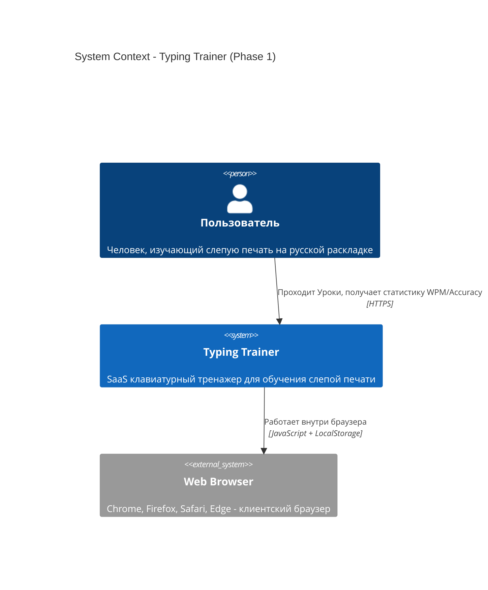

### Планируемая архитектура (Phase 2)

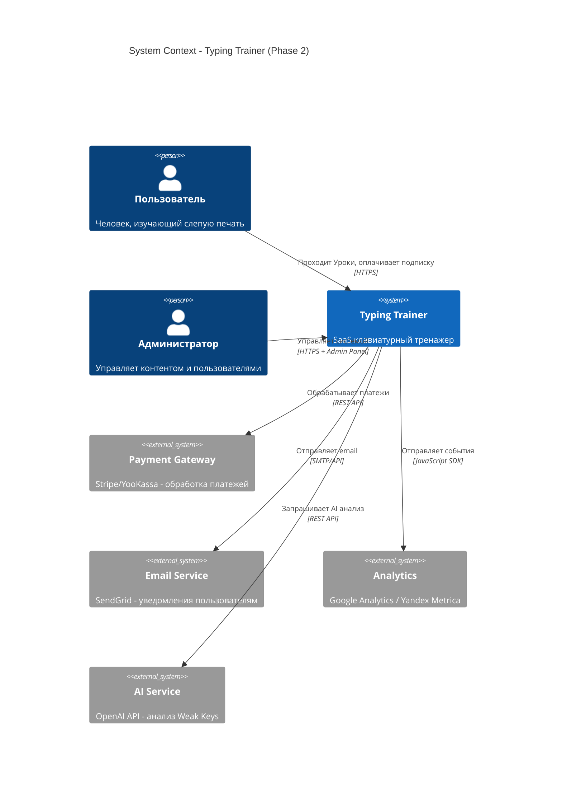

### Основные actors

| Actor | Описание | Роль в системе |
|-------|----------|----------------|
| **Пользователь** | Человек, обучающийся слепой печати | Основной пользователь - проходит Уроки, получает статистику WPM/Accuracy |
| **Начинающий** | Пользователь с WPM < 30 | Проходит Блоки 1-2 (Pinky, Ring Finger) |
| **Продвинутый** | Пользователь с WPM > 60 | Проходит Блоки 4-6 (All fingers, Numbers, Advanced) |
| **Администратор** (Phase 2) | Управляет системой | Создает контент, управляет пользователями, мониторинг |

---

## Level 2: Container

### Описание

Container diagram показывает **основные технические блоки** системы и их взаимодействие.

**Важно:** Container ≠ Docker container. Здесь Container = отдельное приложение/процесс/хранилище.

### Phase 1: Client-Side Architecture (Текущая)

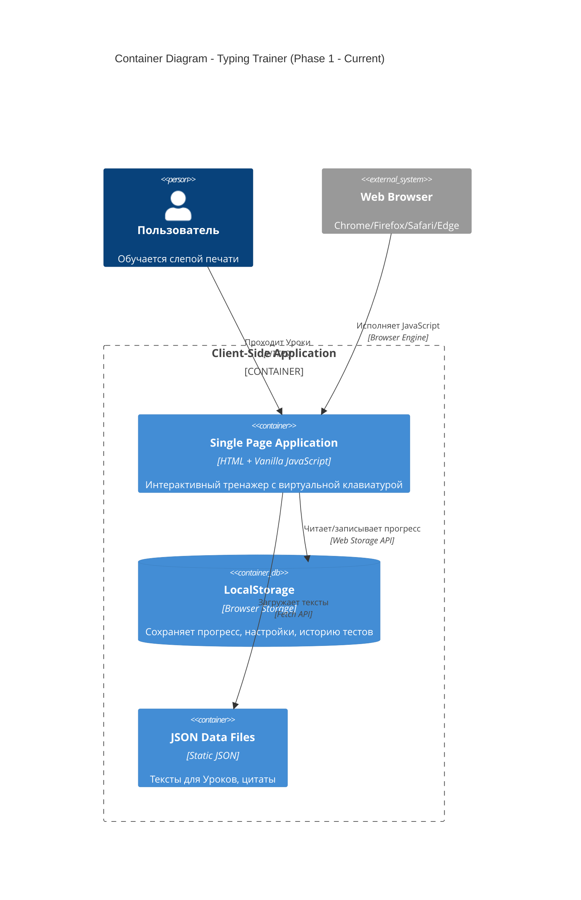

### Phase 2: Full-Stack Architecture (Планируемая)

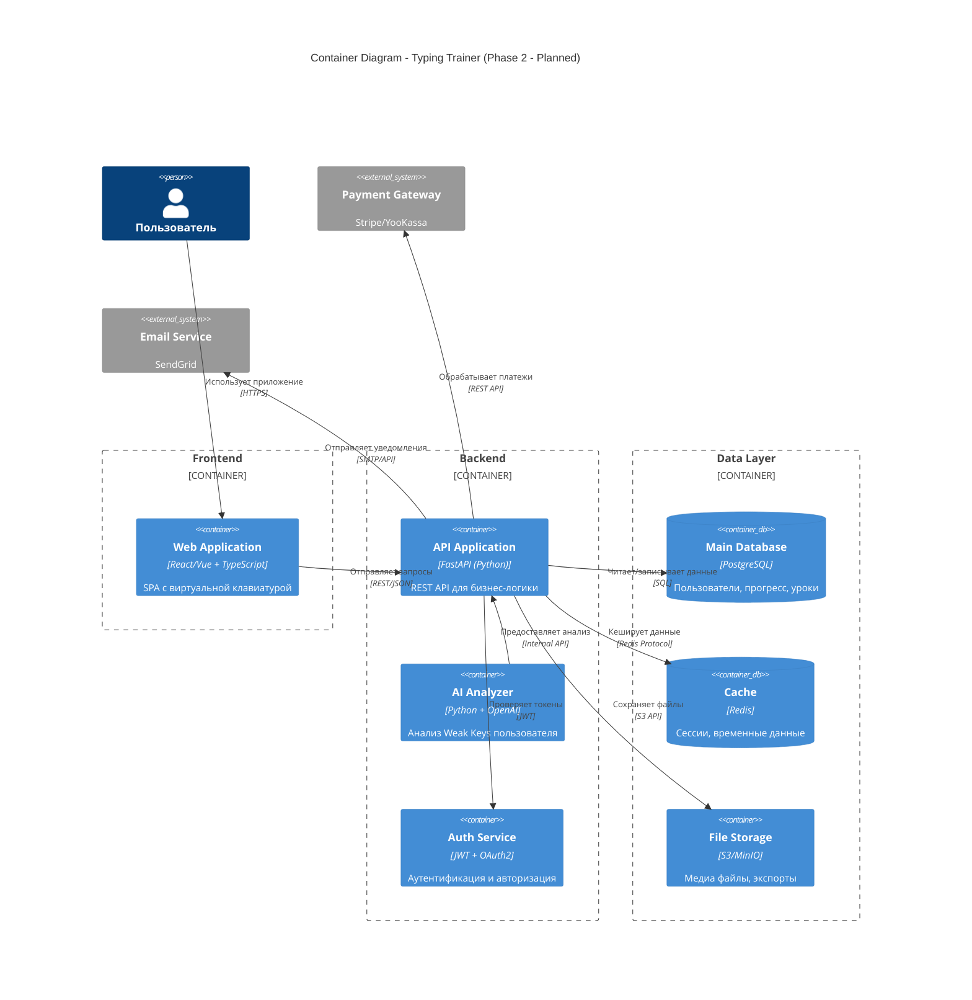

### Описание Containers (Phase 1)

| Container | Технология | Назначение | Данные |
|-----------|------------|------------|--------|
| **Single Page Application** | HTML + Vanilla JS | Основное приложение с UI | 6 модулей: main.js, keyboard.js, stats.js, utils.js, settings.js |
| **LocalStorage** | Browser Web Storage | Персистентность на клиенте | Прогресс Уроков, лучшие результаты, настройки |
| **JSON Data Files** | Static JSON | Контент для Training | `quotes.json`, `data/texts/ru.json` |

### Описание Containers (Phase 2 - Planned)

| Container | Технология | Назначение |
|-----------|------------|------------|
| **Web Application** | React/Vue + TS | Frontend SPA |
| **API Application** | FastAPI | REST API backend |
| **AI Analyzer** | Python + OpenAI | Weak Keys analysis |
| **Auth Service** | JWT + OAuth2 | Аутентификация |
| **Main Database** | PostgreSQL | Основное хранилище |
| **Cache** | Redis | Кеширование сессий |
| **File Storage** | S3/MinIO | Медиа и экспорты |

---

## Level 3: Component

### Описание

Component diagram показывает **модули внутри каждого Container**.

### Phase 1: SPA Components (Текущая архитектура)

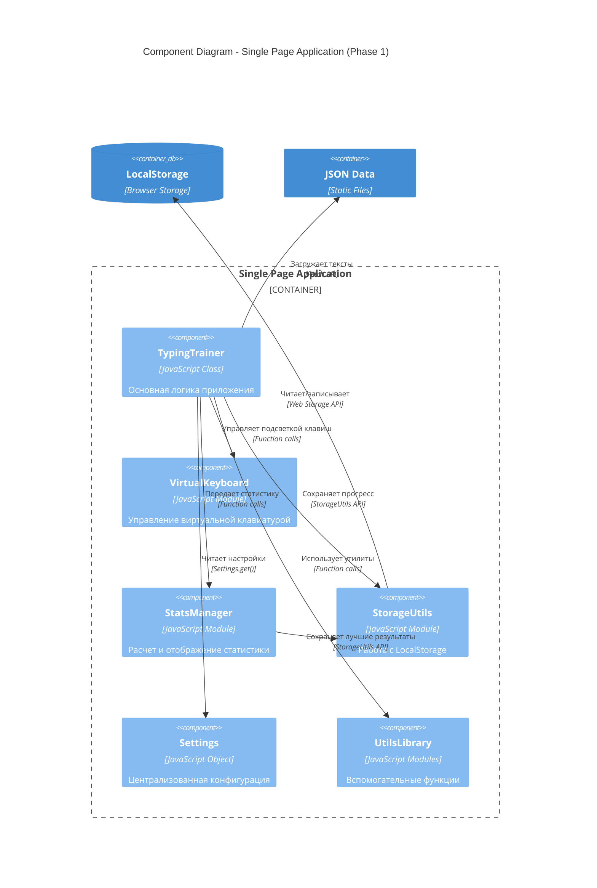

### Детали компонентов (Phase 1)

#### 1. TypingTrainer (main.js)

**Назначение:** Центральный контроллер приложения

**Ключевые функции:**
- `startNewTest()` - начало нового Урока
- `handleInput(event)` - обработка ввода пользователя
- `calculateWPM()` - вычисление скорости печати
- `calculateAccuracy()` - вычисление точности
- `finishTest()` - завершение Урока
- `saveTestResult()` - сохранение результата

**State Management:**
```javascript
{
  currentText: string,      // Текущий Typing Text
  typedText: string,        // Уже напечатанный текст
  currentPosition: number,  // Позиция курсора
  isTestActive: boolean,    // Активен ли тест
  startTime: timestamp,     // Время начала
  errors: number,           // Количество ошибок
  currentLevel: string      // Difficulty Level
}
```

#### 2. VirtualKeyboard (keyboard.js)

**Назначение:** Управление виртуальной клавиатурой

**Ключевые функции:**
- `highlightKey(char)` - подсветка следующей клавиши (Key Highlight)
- `pressKey(key, code)` - визуализация нажатия
- `releaseKey(key)` - сброс подсветки
- `animateCorrectKey(key)` - анимация правильного ввода
- `animateIncorrectKey(key)` - Error Flash при ошибке

**Цвета пальцев:**
- Pink (#ff7675) - Pinky (мизинец)
- Orange (#fdcb6e) - Ring (безымянный)
- Green (#00b894) - Middle (средний)
- Cyan (#74b9ff) - Index Left (указательный левый)
- Blue (#0984e3) - Index Right (указательный правый)
- Purple (#a29bfe) - Thumb (большой)

#### 3. StatsManager (stats.js)

**Назначение:** Расчет и отображение Real-time Stats

**Метрики:**
- **WPM** = (totalCharacters / 5) / (timeInMinutes)
- **Accuracy** = ((totalChars - errors) / totalChars) * 100%
- **Error Rate** = (errors / totalChars) * 100%
- **Star Rating** = 1-5 звезд (на основе WPM + Accuracy)

**Ключевые функции:**
- `updateStats()` - обновление статистики каждые 100ms
- `calculateRating(wpm, accuracy)` - расчет Star Rating
- `loadBestStats()` - загрузка лучших результатов
- `saveBestStats()` - сохранение рекордов

#### 4. StorageUtils (utils.js)

**Назначение:** Абстракция над LocalStorage

**LocalStorage Keys:**
- `typing_trainer_best_stats` - лучшие результаты (WPM, Accuracy)
- `typing_trainer_user_settings` - настройки пользователя
- `typing_trainer_test_history` - история тестов (последние 100)
- `typing_trainer_current_level` - текущий Difficulty Level

**Ключевые функции:**
- `StorageUtils.set(key, data)` - сохранение с JSON.stringify
- `StorageUtils.get(key, defaultValue)` - чтение с JSON.parse
- `StorageUtils.remove(key)` - удаление
- `StorageUtils.clear()` - полная очистка

#### 5. Settings (config/settings.js)

**Назначение:** Центральная конфигурация через объект `APP_CONFIG`

**Структура:**
```javascript
APP_CONFIG = {
  difficultyLevels: {
    beginner: { targetWPM: 15, maxErrors: 10 },
    easy: { targetWPM: 25, maxErrors: 8 },
    medium: { targetWPM: 40, maxErrors: 6 },
    ...
  },
  rating: {
    stars: {
      5: { minWPM: 100, minAccuracy: 95 },
      4: { minWPM: 80, minAccuracy: 90 },
      ...
    }
  },
  keyboard: {
    fingerColors: { ... },
    animation: { ... }
  }
}
```

**API:**
- `Settings.get(path, defaultValue)` - получение значения по пути
- `Settings.getLevelColor(level)` - цвет уровня
- `Settings.getRatingCriteria()` - критерии Star Rating

#### 6. UtilsLibrary (utils.js)

**Модули:**
- `DOMUtils` - работа с DOM (`$()`, `$$()`, createElement)
- `TimeUtils` - форматирование времени (MM:SS)
- `TextUtils` - текстовые утилиты
- `DebugUtils` - логирование
- `NotificationUtils` - уведомления

---

### Phase 2: API Components (Планируемая архитектура)

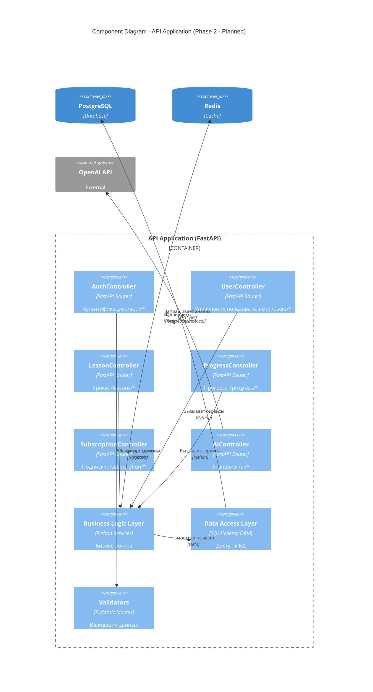

### API Endpoints (Phase 2 - Planned)

| Endpoint | Method | Описание | Request | Response |
|----------|--------|----------|---------|----------|
| `/auth/register` | POST | Регистрация | `{email, password}` | `{user_id, token}` |
| `/auth/login` | POST | Вход | `{email, password}` | `{token, refresh_token}` |
| `/users/me` | GET | Профиль | - | `{user_data}` |
| `/users/{id}/progress` | GET | Прогресс | - | `{lessons_completed, wpm, accuracy}` |
| `/lessons` | GET | Список Уроков | `?block=1&difficulty=pinky` | `{lessons[]}` |
| `/lessons/{id}` | GET | Детали Урока | - | `{lesson_data}` |
| `/progress` | POST | Сохранить результат | `{lesson_id, wpm, accuracy, errors}` | `{success, rating}` |
| `/progress/stats` | GET | Общая статистика | - | `{total_wpm, avg_accuracy, weak_keys}` |
| `/ai/weak-keys-analysis` | POST | AI анализ Weak Keys | `{user_id, history}` | `{weak_keys[], recommendations[]}` |
| `/subscription/status` | GET | Статус подписки | - | `{tier, expires_at}` |
| `/subscription/upgrade` | POST | Апгрейд | `{tier}` | `{payment_url}` |

---

## Level 4: Code

### Описание

Code level показывает **детали реализации ключевых компонентов**: классы, интерфейсы, методы.

### TypingTrainer Class (main.js)

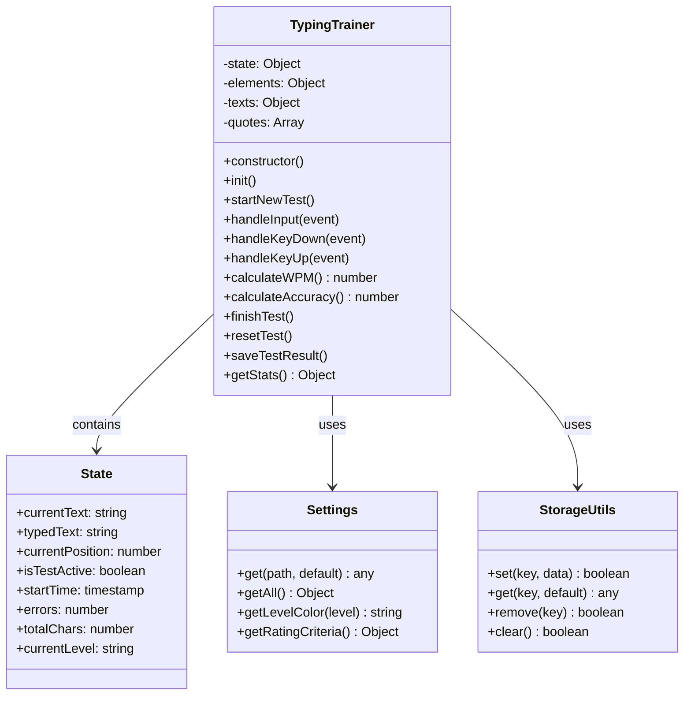

### VirtualKeyboard Module (keyboard.js)

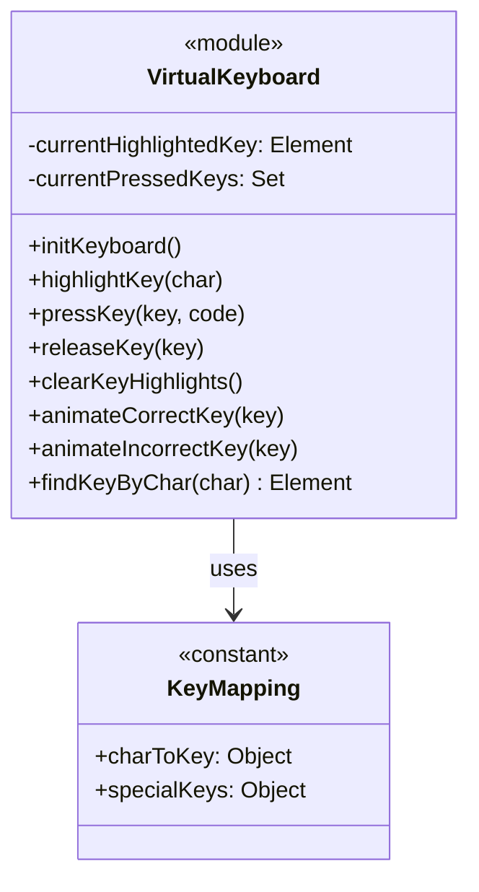

### StatsManager Module (stats.js)

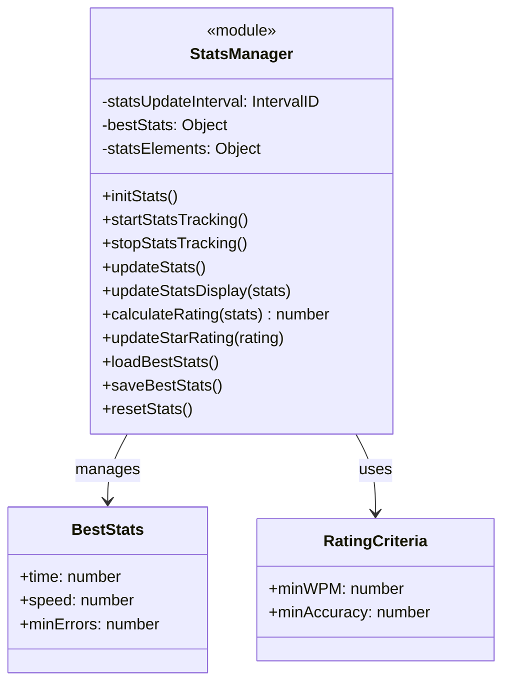

### Settings Configuration (config/settings.js)

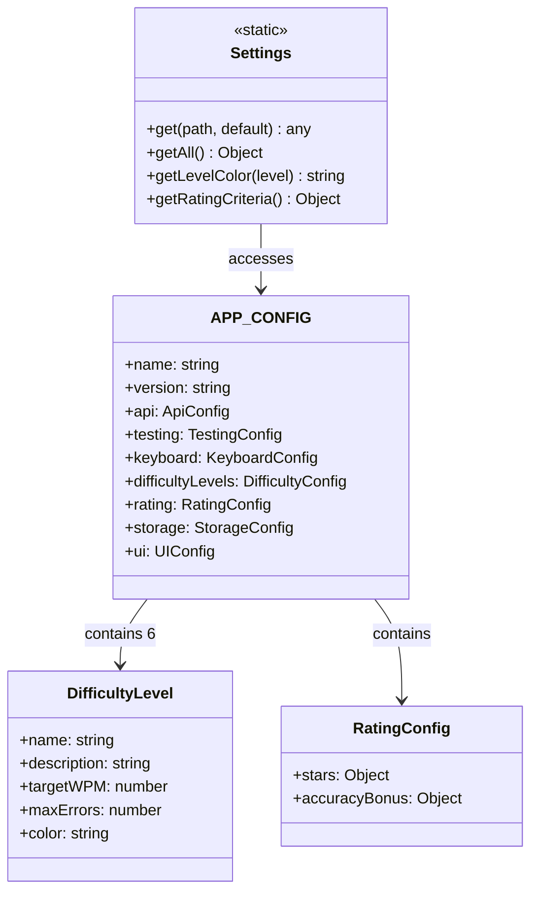

### Data Flow: User Types Character

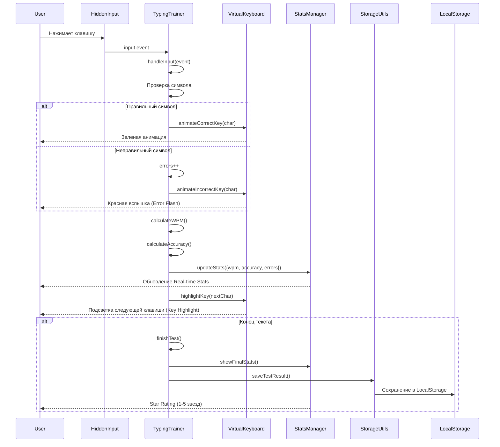

---

## Архитектурные решения

### 1. Модульная архитектура (Module Pattern)

**Решение:** Каждый JavaScript файл - самостоятельный модуль с четкой ответственностью.

**Преимущества:**
- ✅ Разделение ответственности (Separation of Concerns)
- ✅ Легкое тестирование
- ✅ Переиспользование кода
- ✅ Понятная структура

**Модули:**
- `main.js` - TypingTrainer (ядро)
- `keyboard.js` - VirtualKeyboard
- `stats.js` - StatsManager
- `utils.js` - утилиты
- `settings.js` - конфигурация

### 2. Config-Driven Design

**Решение:** Вся конфигурация в `config/settings.js` через объект `APP_CONFIG`.

**Преимущества:**
- ✅ Централизованные настройки
- ✅ Легко менять параметры (targetWPM, colors, etc.)
- ✅ Не нужно искать магические числа в коде
- ✅ Простое A/B тестирование

**Использование:**
```javascript
const targetWPM = Settings.get('difficultyLevels.medium.targetWPM', 40);
const pink = Settings.get('keyboard.fingerColors.pinky', '#ff7675');
```

### 3. LocalStorage для персистентности (Phase 1)

**Решение:** Все данные хранятся в браузере через LocalStorage.

**Преимущества:**
- ✅ Нет Backend - простое развертывание
- ✅ Быстрая разработка MVP
- ✅ Работает оффлайн
- ✅ Бесплатно

**Недостатки (устранены в Phase 2):**
- ❌ Нет синхронизации между устройствами
- ❌ Данные теряются при очистке браузера
- ❌ Нет мультипользовательских возможностей

### 4. Event-Driven Architecture

**Решение:** Взаимодействие через события (keydown, input, etc.)

**Преимущества:**
- ✅ Слабая связанность (Loose Coupling)
- ✅ Легко добавлять новые обработчики
- ✅ Модули не зависят друг от друга напрямую

**События:**
- `input` - ввод символа
- `keydown`/`keyup` - нажатие/отпускание клавиши
- `blur`/`focus` - фокус окна

### 5. Real-time Stats Update

**Решение:** Обновление статистики каждые 100ms через `setInterval`.

**Преимущества:**
- ✅ Мгновенная обратная связь
- ✅ Мотивация пользователя
- ✅ Плавные анимации

**Реализация:**
```javascript
setInterval(() => {
  const stats = window.getStats();
  updateStatsDisplay(stats);
}, 100); // каждые 100ms
```

### 6. Color-Coded Virtual Keyboard

**Решение:** Каждая клавиша окрашена цветом соответствующего пальца.

**Преимущества:**
- ✅ Визуальное обучение
- ✅ Понятно какой палец использовать
- ✅ Соответствует физической клавиатуре

**Цвета:**
- Розовый (Pink) - мизинец
- Оранжевый (Orange) - безымянный
- Зеленый (Green) - средний
- Голубой (Cyan) - указательный левый
- Синий (Blue) - указательный правый
- Фиолетовый (Purple) - большой

### 7. Progressive Difficulty System

**Решение:** 6 уровней сложности (Difficulty Levels) от Pinky до Advanced.

**Преимущества:**
- ✅ Постепенное обучение
- ✅ Мотивация через progression
- ✅ Адаптация под уровень пользователя

**Уровни:**
1. Pinky (Мизинец) - targetWPM: 15
2. Ring (Безымянный) - targetWPM: 25
3. Middle (Средний) - targetWPM: 40
4. Index Left - targetWPM: 60
5. Index Right - targetWPM: 80
6. Advanced - targetWPM: 100

### 8. Star Rating System

**Решение:** Оценка от 1 до 5 звезд на основе WPM + Accuracy.

**Преимущества:**
- ✅ Геймификация
- ✅ Ясные цели для улучшения
- ✅ Мотивация повторить урок

**Критерии:**
- ⭐⭐⭐⭐⭐ 5 звезд: WPM ≥ 100, Accuracy ≥ 95%
- ⭐⭐⭐⭐ 4 звезды: WPM ≥ 80, Accuracy ≥ 90%
- ⭐⭐⭐ 3 звезды: WPM ≥ 60, Accuracy ≥ 85%
- ⭐⭐ 2 звезды: WPM ≥ 40, Accuracy ≥ 80%
- ⭐ 1 звезда: WPM ≥ 20, Accuracy ≥ 70%

---

## Migration Path (Phase 1 → Phase 2)

### Стратегия миграции

**Цель:** Постепенный переход от Client-Side к Full-Stack без потери данных пользователей.

### Этапы миграции

#### Этап 1: Backend Development (Параллельно с Phase 1)

**Задачи:**
- Разработка Backend Architecture (Борис)
- Создание PostgreSQL schema
- Разработка REST API (FastAPI)
- Настройка Authentication (JWT)

**Статус:** 🔵 In Progress (Борис работает над Backend Architecture document)

#### Этап 2: Data Migration Strategy

**Проблема:** Пользователи Phase 1 имеют данные в LocalStorage. Нужно перенести их в PostgreSQL.

**Решение:**

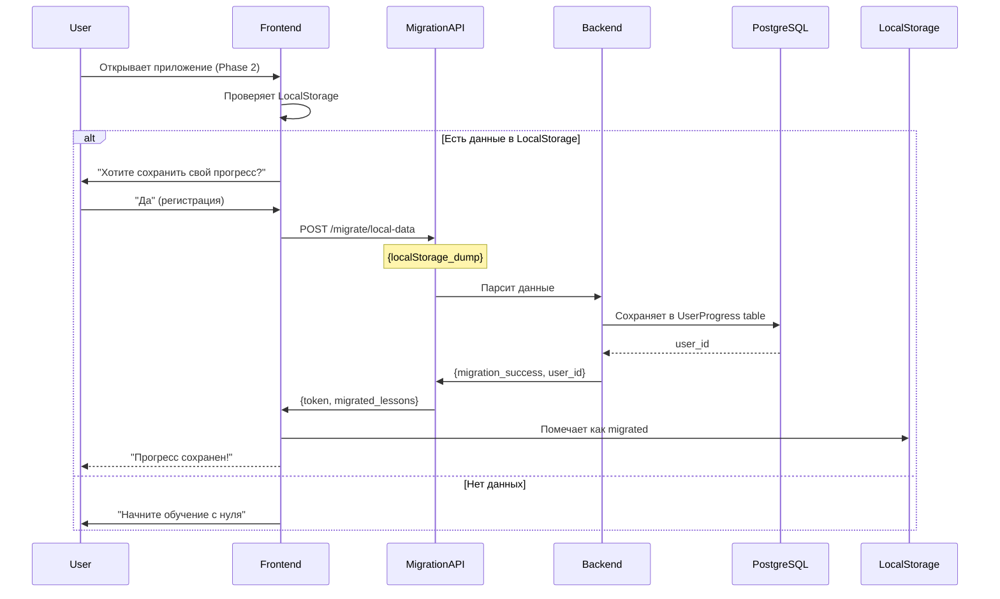

**LocalStorage → PostgreSQL mapping:**

| LocalStorage Key | PostgreSQL Table | Mapping |
|------------------|------------------|---------|
| `typing_trainer_best_stats` | `UserProgress.best_wpm`, `best_accuracy` | Direct |
| `typing_trainer_test_history` | `TestHistory` table | Array → Rows |
| `typing_trainer_user_settings` | `UserSettings` table | JSON → Columns |
| `typing_trainer_current_level` | `Users.current_difficulty_level` | Direct |

#### Этап 3: Hybrid Mode (Transition Period)

**Идея:** Приложение работает в двух режимах:
- **Authenticated Mode** - с Backend (Phase 2)
- **Guest Mode** - только LocalStorage (Phase 1)

**Преимущества:**
- ✅ Плавный переход
- ✅ Пользователи могут попробовать без регистрации
- ✅ Gradual rollout

**Реализация:**
```javascript
class DataAdapter {
  constructor() {
    this.mode = this.detectMode(); // 'authenticated' | 'guest'
  }

  async saveProgress(data) {
    if (this.mode === 'authenticated') {
      return await API.post('/progress', data);
    } else {
      return StorageUtils.set('progress', data);
    }
  }

  async loadProgress() {
    if (this.mode === 'authenticated') {
      return await API.get('/progress');
    } else {
      return StorageUtils.get('progress');
    }
  }
}
```

#### Этап 4: Full Migration to Phase 2

**Когда:** Через 3-6 месяцев после запуска Phase 2

**Действия:**
- Отключение Guest Mode
- Все пользователи должны зарегистрироваться
- LocalStorage используется только для кеширования

---

## Связанные документы

### Процессы:
- [Specification Workflow](../processes/Specification_Workflow.md) - процесс создания спецификаций
- [Documentation Audit Guide](../processes/Documentation_Audit_Guide.md) - аудит документации

### Стандарты:
- [Terminology System](../domain/typing-terminology.md) - **ОБЯЗАТЕЛЬНО** использовать термины отсюда
- [Accessibility Compliance](../specs/006_Accessibility_Compliance_Specification.md) - WCAG 2.1 Level AA

### Архитектура:
- [Backend Architecture](./Backend_Architecture.md) - детальная архитектура Backend (Борис создает)

### Спецификации:
- [Spec 001: AI Weak Keys Analyzer](../specs/001_AI_Weak_Keys_Analyzer.md) - AI анализ Weak Keys
- [Spec 002-005](../specs/) - другие функциональные спецификации

### Планирование:
- [ROADMAP](../planning/ROADMAP.md) - план развития проекта (Тимофей создаст)

### User Documentation:
- [Quick Start Guide](../user/Quick_Start_Guide.md) - быстрый старт для новых пользователей (Тимофей создаст)
- [FAQ](../user/FAQ.md) - часто задаваемые вопросы (Тимофей создаст)
- [User Guide](../user/User_Guide.md) - полное руководство пользователя (Тимофей создаст)

---

## Changelog

| Дата | Версия | Изменения | Автор |
|------|--------|-----------|-------|
| 2025-11-16 | 1.0 | Initial creation - все 4 уровня C4 diagrams | Тимофей |

---

## Метаданные

**Статус:** ✅ Готово к review
**Reviewer:** Клод (Architect)
**Next Steps:**
1. Review от Клода
2. Согласование с Борисом (Backend Architecture alignment)
3. Merge в master branch

**Maintained by:** Тимофей (Technical Writer)
**Last Updated:** 16 ноября 2025
**Version:** 1.0
